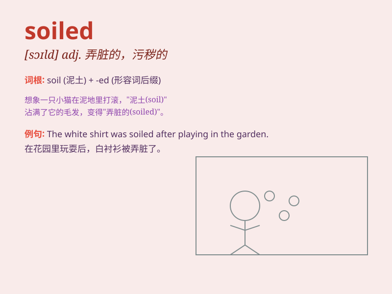

## soiled

**英音:** _[sɔɪld]_ **美音:** _[sɔɪld]_

**译义:** *adj. 弄脏的，污秽的；被玷污的 v.
弄脏（soil的过去分词）*

### 短语

+ **soiled clothes:** _脏衣服_

+ **soiled hands:** _弄脏的手_

+ **soiled reputation:** _受损的声誉_

+ **soiled environment:** _受污染的环境_

+ **soiled linen:** _脏的亚麻布_

### 例句

#### 例句1

> **The child\'s clothes were soiled after playing in the mud.**

**中文翻译:** 孩子在泥地里玩后衣服弄脏了。

**单词释义:** 弄脏的

#### 例句2

> **The hotel room\'s carpet was soiled with stains.**

**中文翻译:** 酒店房间的地毯有污渍，弄脏了。

**单词释义:** 被弄脏的

#### 例句3

> **She had to change her soiled dress before going to the party.**

**中文翻译:** 她在去聚会前不得不换下弄脏的连衣裙。

**单词释义:** 弄脏了的

### 背诵小故事

> A little rabbit played in the garden and accidentally soiled its
white fur. It had to go back home and clean itself. Poor rabbit!
Remember, soiled means made dirty or stained.

**一只小兔子在花园里玩耍，不小心弄脏了它白色的毛。它不得不回家清洗自己。可怜的兔子！记住，soiled
意思是弄脏、玷污。**

### 图义

