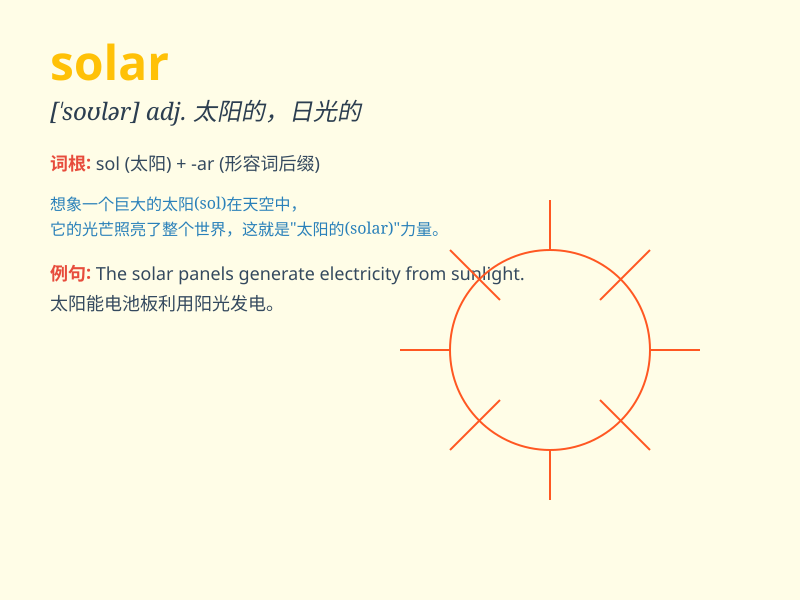

## solar

**英音:** _[\'səʊlə]_ **美音:** _[\'solɚ]_

**译义:** *adj.太阳的,日光的*

### 短语

+ **solar system:** _太阳系_

+ **solar energy:** _太阳能_

+ **solar panel:** _太阳能电池板_

+ **solar eclipse:** _日食_

+ **solar power:** _太阳能动力_

### 例句

#### 例句1

> **Solar panels are becoming more and more popular for generating
electricity.**

**中文翻译:** 太阳能电池板在发电方面变得越来越受欢迎。

**单词释义:** 太阳能的

#### 例句2

> **The solar system consists of the sun and the planets that orbit
it.**

**中文翻译:** 太阳系由太阳和围绕它运行的行星组成。

**单词释义:** 太阳的；与太阳有关的

#### 例句3

> **We need to develop more efficient solar energy technologies to
meet our energy demands.**

**中文翻译:** 我们需要开发更高效的太阳能技术来满足我们的能源需求。

**单词释义:** 太阳能的

### 背诵小故事

>
想象一下，在一个遥远的星球上，有一座神奇的城堡，城堡的能源全部来自太阳。这个城堡被称为\'solar
castle\'，因为\'solar\'就是太阳的、与太阳有关的。所以当你看到\'solar\'，就想起那个充满阳光能源的城堡。

**想象在遥远星球上有座能源全来自太阳的神奇城堡叫\'solar
castle\'，帮助记住\'solar\'是太阳的、与太阳有关的意思。**

### 图义

