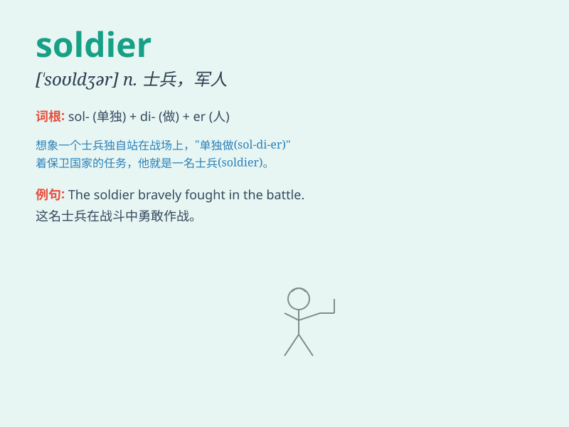

## soldier

**英音:** _[\'səʊldʒə]_ **美音:** _[\'soldʒɚ]_

**译义:** *n.士兵,军人*

### 短语

+ **soldier on:** _坚持；硬挺着_

+ **private soldier:** _列兵；士兵_

+ **professional soldier:** _职业军人_

+ **soldier of fortune:** _雇佣兵；冒险家_

+ **wounded soldier:** _受伤的士兵_

### 例句

#### 例句1

> **The soldier fought bravely on the battlefield.**

**中文翻译:** 这位士兵在战场上英勇作战。

**单词释义:** 士兵

#### 例句2

> **He dreams of becoming a soldier when he grows up.**

**中文翻译:** 他梦想长大后成为一名士兵。

**单词释义:** 士兵

#### 例句3

> **The injured soldier was carried away on a stretcher.**

**中文翻译:** 受伤的士兵被用担架抬走了。

**单词释义:** 士兵

### 背诵小故事

> In a war-torn land, a brave young man decided to become a soldier. He
trained hard, faced many dangers, and never gave up. His courage and
determination made him a true soldier, protecting his country and
people.

**在一个饱受战争蹂躏的土地上，一个勇敢的年轻人决定成为一名士兵。他刻苦训练，面对诸多危险，从不放弃。他的勇气和决心使他成为了一名真正的士兵，保护着他的国家和人民。**

### 图义

