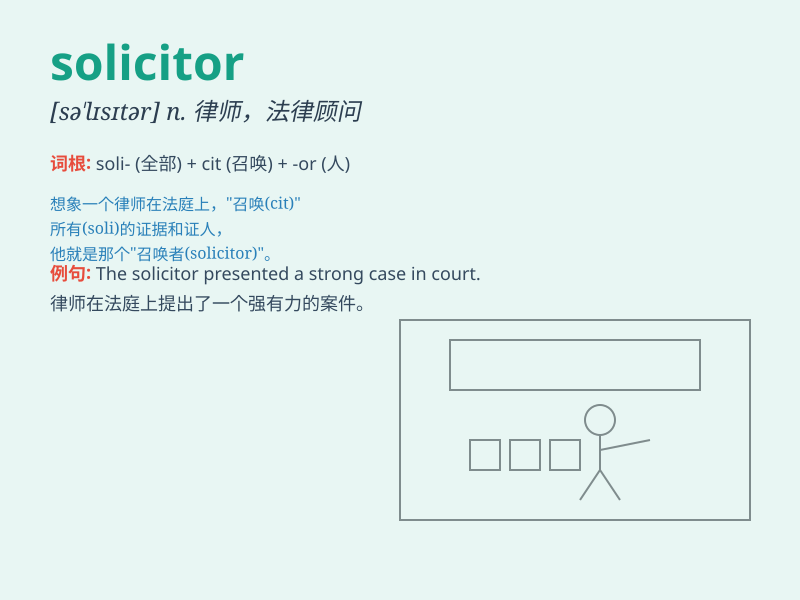

## solicitor

**英音:** _[sə\'lɪsɪtə]_ **美音:** _[sə\'lɪsɪtɚ]_

**译义:** *n.律师,法律顾问*

### 短语

+ **solicitor general:** _副检察长；副总检察长_

+ **solicitor firm:** _律师事务所_

+ **criminal solicitor:** _刑事律师_

+ **property solicitor:** _房地产律师_

+ **family solicitor:** _家庭律师_

### 例句

#### 例句1

> **The solicitor advised her on the legal aspects of the case.**

**中文翻译:** 律师就案件的法律方面给她提供了建议。

**单词释义:** 律师

#### 例句2

> **She hired a solicitor to handle her divorce proceedings.**

**中文翻译:** 她雇了一名律师来处理她的离婚诉讼。

**单词释义:** 律师

#### 例句3

> **The solicitor drew up the contract for the sale of the
property.**

**中文翻译:** 律师起草了房产销售合同。

**单词释义:** 律师

### 背诵小故事

> A young man dreamed of becoming a solicitor. He studied hard, helped
people solve legal problems, and finally achieved his dream. A solicitor
is like a legal hero, fighting for justice.

**一个年轻人梦想成为一名律师。他努力学习，帮助人们解决法律问题，最终实现了梦想。律师就像法律界的英雄，为正义而战。**

### 图义

