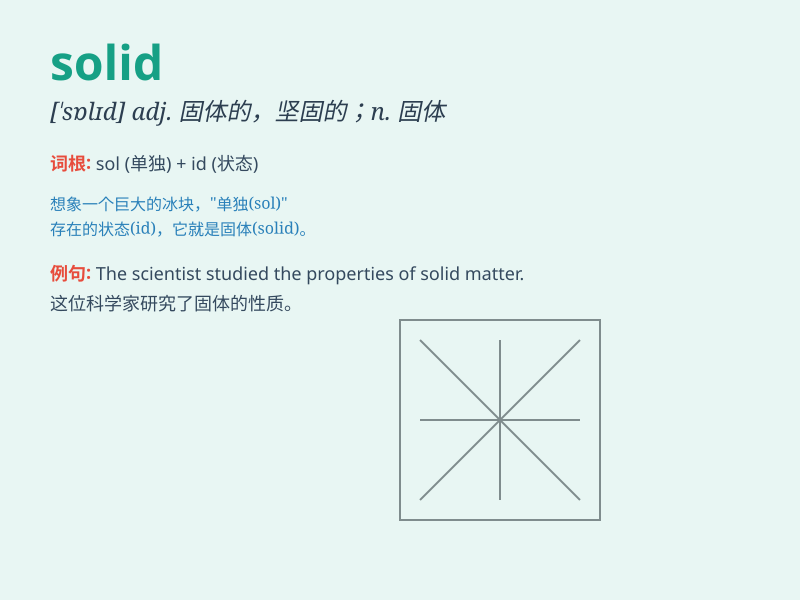

## solid

**英音:** _[\'sɒlɪd]_ **美音:** _[\'sɑlɪd]_

**译义:**
*n.固体,立体adj.固体的,实心的,坚固的,结实的,立体的,可靠的,一致的,纯粹的*

### 短语

+ **solid foundation:** _坚实的基础_

+ **solid evidence:** _确凿的证据_

+ **solid state:** _固态；固体状态_

+ **solid wood:** _实木_

+ **solid color:** _纯色_

### 例句

#### 例句1

> **The table is made of solid wood.**

**中文翻译:** 这张桌子是由实木制成的。

**单词释义:** 坚固的；结实的

#### 例句2

> **She has a solid foundation in mathematics.**

**中文翻译:** 她在数学方面有坚实的基础。

**单词释义:** 坚实的；可靠的

#### 例句3

> **The company has achieved solid profits this year.**

**中文翻译:** 这家公司今年获得了丰厚的利润。

**单词释义:** 丰厚的；相当不错的

### 背诵小故事

> A little ant was walking in the forest. It found a solid rock and
tried to push it, but the rock didn\'t move at all. The ant realized
that\'solid\' means very firm and hard to change.

**一只小蚂蚁在森林里走着。它发现了一块坚固的石头并试图推动它，但石头根本不动。蚂蚁意识到\'solid\'意味着非常坚固且难以改变。**

### 图义

