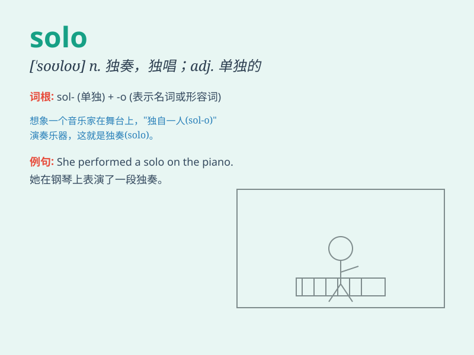

## solo

**英音:** _[\'səʊləʊ]_ **美音:** _[\'solo]_

**译义:** *n.独奏曲adj.单独的*

### 短语

+ **solo flight:** _单人飞行_

+ **solo performance:** _独奏表演；单人表演_

+ **solo album:** _个人专辑_

+ **solo artist:** _独唱艺术家；独奏艺术家_

+ **play a solo:** _演奏独奏_

### 例句

#### 例句1

> **She gave a solo performance on the piano.**

**中文翻译:** 她进行了一场钢琴独奏表演。

**单词释义:** 单独的，独奏的

#### 例句2

> **He decided to go on a solo trip around Europe.**

**中文翻译:** 他决定独自去欧洲旅行。

**单词释义:** 独自的

#### 例句3

> **The singer\'s latest album features several solo tracks.**

**中文翻译:** 这位歌手的最新专辑中有几首独唱曲目。

**单词释义:** 独唱的，单人的

### 背诵小故事

> A brave musician decided to go on a solo journey. He left his band
and played music alone on the street. People were amazed by his solo
performance. It was a risky but rewarding adventure.

**一位勇敢的音乐家决定踏上独自的旅程。他离开了他的乐队，独自在街头演奏音乐。人们对他的单人表演感到惊讶。这是一次冒险但有收获的经历。**

### 图义

