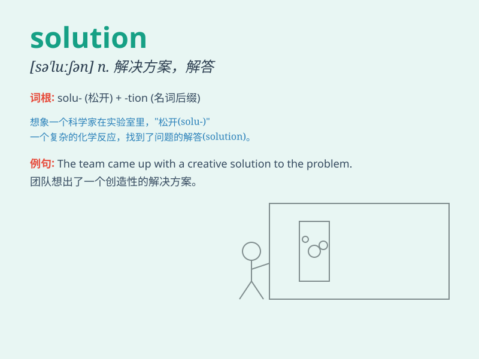

## solution

**英音:** _[sə\'luːʃ(ə)n]_ **美音:** _[sə\'luʃən]_

**译义:** *n.解答,解决办法,溶解,溶液 解决方案*

### 短语

+ **solution to:** _......的解决办法_

+ **find a solution:** _找到解决办法_

+ **propose a solution:** _提出解决办法_

+ **optimal solution:** _最优解_

+ **viable solution:** _可行的解决办法_

### 例句

#### 例句1

> **We need to find a solution to this problem.**

**中文翻译:** 我们需要找到解决这个问题的办法。

**单词释义:** 解决办法；解决方案

#### 例句2

> **The best solution is to work harder.**

**中文翻译:** 最好的解决办法是更努力地工作。

**单词释义:** 解决办法；解决方案

#### 例句3

> **This is not a long-term solution.**

**中文翻译:** 这不是一个长期的解决办法。

**单词释义:** 解决办法；解决方案

### 背诵小故事

> A chemist was struggling to find a SOLUTION to a complex chemical
problem. After many experiments, a brilliant idea came to him. Finally,
he discovered the right mixture, and the SOLUTION was found!

**一位化学家努力寻找一个复杂化学问题的解决方案。经过多次实验，一个绝妙的想法出现在他脑海中。最终，他发现了正确的混合物，解决方案找到了！**

### 图义

