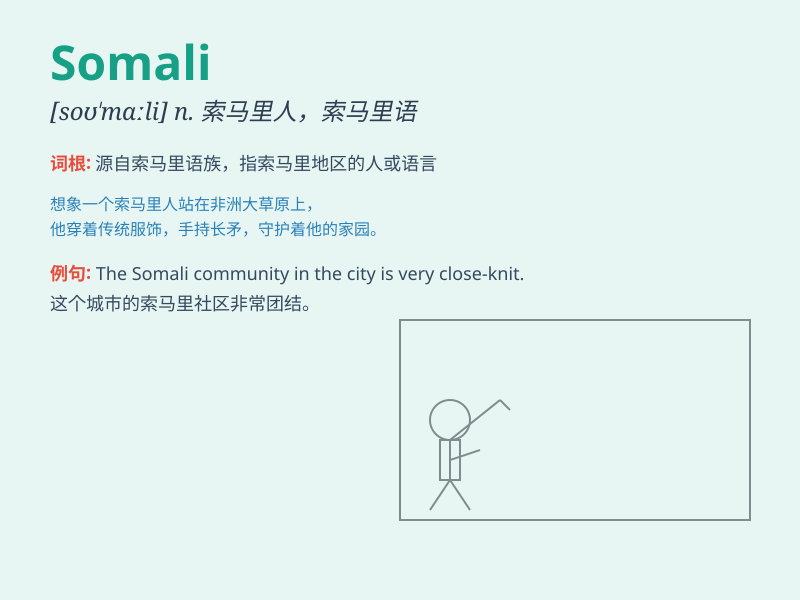

## Somali

**英音:** _[səˈmɑːli]_ **美音:** _[səˈmɑːli]_

**译义:** *索马里的；索马里人；索马里语（adj./n./lang.）*

### 短语

+ **Somali cat:** _索马里猫_

+ **Somali pirates:** _索马里海盗_

+ **Somali language:** _索马里语_

+ **Somali people:** _索马里人_

+ **Somali Republic:** _索马里共和国_

### 例句

#### 例句1

> **The Somali pirates are a major threat to international
shipping.**

**中文翻译:** 索马里海盗是国际航运的一大威胁。

**单词释义:** 索马里的；索马里人的

#### 例句2

> **She is doing research on Somali culture.**

**中文翻译:** 她正在研究索马里文化。

**单词释义:** 索马里的

#### 例句3

> **The Somali people have a rich history.**

**中文翻译:** 索马里人民有着丰富的历史。

**单词释义:** 索马里的；索马里人

### 背诵小故事

> A Somali adventurer set out on a journey across the desert. He faced
many challenges but his courage never wavered. Finally, he reached his
destination and became a hero. Remember, Somali means relating to
Somalia or its people.

**一位索马里冒险家出发穿越沙漠。他面临诸多挑战，但勇气从未动摇。最终，他到达目的地，成为了英雄。记住，Somali
意思是与索马里或其人民有关的。**

### 图义

