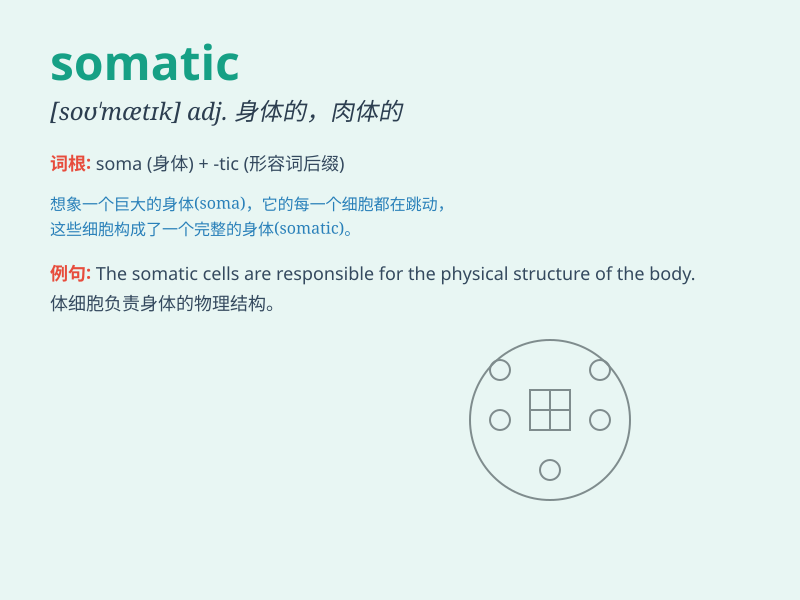

## somatic

**英音:** _[sə\'mætɪk]_ **美音:** _[so\'mætɪk]_

**译义:** *adj.肉体的*

### 短语

+ **somatic cell:** _体细胞_

+ **somatic mutation:** _体细胞突变_

+ **somatic nervous system:** _躯体神经系统_

+ **somatic symptom:** _躯体症状_

+ **somatic embryo:** _体细胞胚_

### 例句

#### 例句1

> **The doctor diagnosed the patient\'s condition as a somatic
disorder.**

**中文翻译:** 医生诊断病人的病情为躯体障碍。

**单词释义:** 躯体的；肉体的

#### 例句2

> **Somatic cells make up most of the body\'s tissues and organs.**

**中文翻译:** 体细胞构成了身体大部分的组织和器官。

**单词释义:** 体细胞的

#### 例句3

> **The therapy aimed to address the somatic symptoms of stress.**

**中文翻译:** 该疗法旨在解决压力的躯体症状。

**单词释义:** 身体的；肉体的

### 背诵小故事

> A scientist was studying the somatic cells of a mysterious creature.
He found that these somatic cells were the key to understanding its
physical structure and functions. The somatic cells determined
everything about its body.

**一位科学家正在研究一种神秘生物的体细胞。他发现这些体细胞是理解其身体结构和功能的关键。体细胞决定了它身体的一切。**

### 图义

