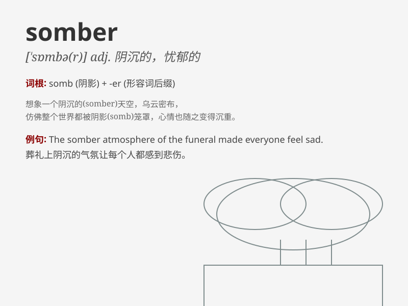

## somber

**英音:** _[ˈsɒmbə(r)]_ **美音:** _[ˈsɑːmbər]_

**译义:** *adj.阴森的,昏暗的,阴天的,忧郁的*

### 短语

+ **somber mood:** _忧郁的心情_

+ **somber face:** _阴沉的脸_

+ **somber atmosphere:** _沉闷的气氛_

+ **somber color:** _暗淡的颜色_

+ **somber outlook:** _悲观的前景_

### 例句

#### 例句1

> **The funeral was a somber occasion.**

**中文翻译:** 葬礼是一个阴沉的场合。

**单词释义:** 阴沉的；忧郁的

#### 例句2

> **He wore a somber expression on his face.**

**中文翻译:** 他脸上带着忧郁的表情。

**单词释义:** 忧郁的；严肃的

#### 例句3

> **The room was decorated in somber colors.**

**中文翻译:** 房间用阴沉的颜色装饰着。

**单词释义:** 阴沉的；暗淡的

### 背诵小故事

> A man was walking in a somber forest. The sky was dark and the trees
seemed sad. He felt very down as if the whole place was filled with a
gloomy mood. Later, he realized \'somber\' means dark and gloomy.

**一个男人在阴暗的森林里走着。天空昏暗，树木看起来也很悲伤。他心情非常低落，仿佛整个地方都弥漫着忧郁的氛围。后来，他明白了'somber'意思是昏暗忧郁的。**

### 图义

