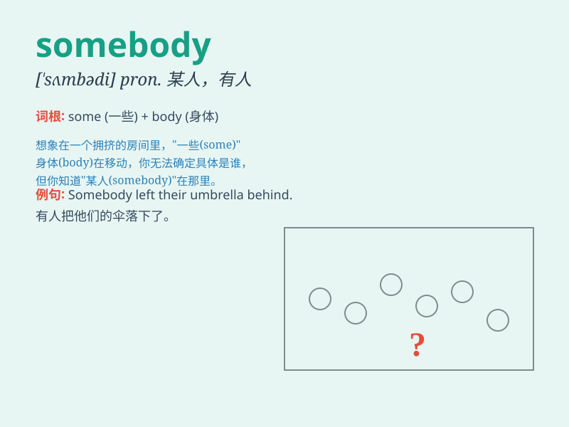

## somebody

**英音:** _[\'sʌmbədɪ]_ **美音:** _[\'sʌmbədi]_

**译义:** *n.重要人物,有名气的人 pron.有人,某人*

### 短语

+ **somebody else:** _其他人_

+ **be somebody:** _成为重要人物_

+ **call somebody names:** _辱骂某人_

+ **make somebody do something:** _使某人做某事_

+ **trust somebody:** _信任某人_

### 例句

#### 例句1

> **Somebody has stolen my wallet.**

**中文翻译:** 有人偷了我的钱包。

**单词释义:** 某人

#### 例句2

> **I need somebody to help me with this task.**

**中文翻译:** 我需要有人帮我做这项任务。

**单词释义:** 某人

#### 例句3

> **Somebody must have known the truth.**

**中文翻译:** 一定有人知道真相。

**单词释义:** 某人

### 背诵小故事

> One day, a little mouse was lost in a big forest. It was very scared
and hoped somebody could help it. Finally, a kind bird appeared and
guided the mouse out of the forest.

**有一天，一只小老鼠在大森林里迷路了。它非常害怕，希望有人能帮助它。最后，一只善良的鸟出现了，并引导老鼠走出了森林。**

### 图义

