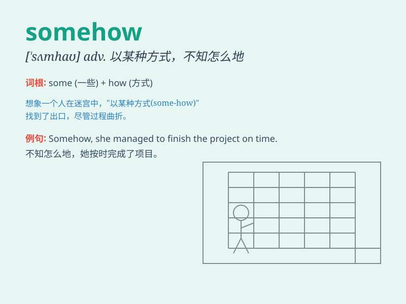

## somehow

**英音:** _[\'sʌmhaʊ]_ **美音:** _[\'sʌmhaʊ]_

**译义:** *adv.不知何故*

### 短语

+ **somehow or other:** _以某种方式；用某种办法_

+ **get somehow:** _设法得到_

+ **manage somehow:** _设法应付_

+ **figure out somehow:** _设法弄明白_

+ **solve the problem somehow:** _设法解决问题_

### 例句

#### 例句1

> **Somehow, I managed to finish the project on time.**

**中文翻译:** 不知怎么地，我设法按时完成了这个项目。

**单词释义:** 以某种方式；不知怎么地

#### 例句2

> **The problem was solved somehow.**

**中文翻译:** 这个问题不知怎么地被解决了。

**单词释义:** 不知怎么；莫名其妙地

#### 例句3

> **Somehow, I don\'t think he\'ll come.**

**中文翻译:** 不知为什么，我觉得他不会来。

**单词释义:** 不知为什么；不知什么原因

### 背诵小故事

> One day, I lost my keys. Somehow, they magically reappeared on the
table when I came back home. It was a mystery how they got there, but
\'somehow\' it happened.

**有一天，我丢了钥匙。不知怎么地，当我回家时，它们神奇地又出现在桌子上。它们怎么到那里的是个谜，但不知怎么就发生了。**

### 图义

