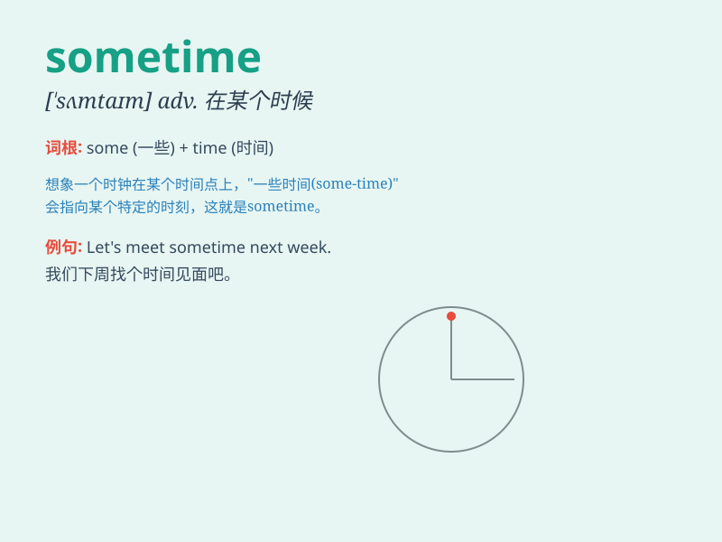

## sometime

**英音:** _[\'sʌmtaɪm]_ **美音:** _[\'sʌmtaɪm]_

**译义:** *adv.在某一时候,曾经,有一天*

### 短语

+ **sometime ago:** _一段时间以前_

+ **sometime later:** _一段时间以后_

+ **at sometime:** _在某个时候_

+ **sometime next week:** _下周的某个时候_

+ **sometime this month:** _这个月的某个时候_

### 例句

#### 例句1

> **Let\'s meet sometime next week.**

**中文翻译:** 咱们下周某个时候见。

**单词释义:** 某个时候

#### 例句2

> **He decided to take a trip sometime in May.**

**中文翻译:** 他决定在五月的某个时候去旅行。

**单词释义:** 某个时候

#### 例句3

> **Sometime I think about changing my job.**

**中文翻译:** 有时我考虑换工作。

**单词释义:** 有时

### 背诵小故事

> One day, a little girl was lost. She hoped to find her way home
sometime. After a long search, sometime in the afternoon, she finally
saw a familiar street and reached home safely.

**有一天，一个小女孩迷路了。她希望能在某个时候找到回家的路。经过长时间的寻找，在下午的某个时候，她终于看到了一条熟悉的街道，安全到家了。**

### 图义

