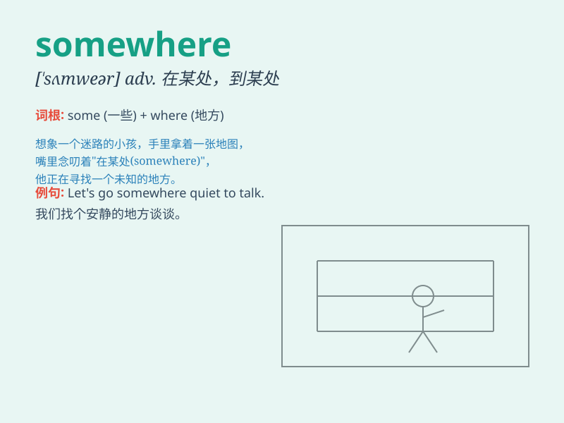

## somewhere

**英音:** _[\'sʌmweə]_ **美音:** _[\'sʌmwɛr]_

**译义:** *adv.某处,在某处*

### 短语

+ **get somewhere:** _有所成就；取得进展_

+ **somewhere around:** _大约；在\...\...左右_

+ **be somewhere else:** _在别处_

+ **put somewhere:** _放置在某处_

+ **go somewhere nice:** _去个好地方_

### 例句

#### 例句1

> **I lost my keys somewhere in the house.**

**中文翻译:** 我把钥匙丢在家里的某个地方了。

**单词释义:** 在某处；到某处

#### 例句2

> **Let\'s go somewhere quiet to talk.**

**中文翻译:** 咱们找个安静的地方谈谈。

**单词释义:** 某个地方

#### 例句3

> **He must be hiding somewhere.**

**中文翻译:** 他一定藏在什么地方。

**单词释义:** 在某处

### 背诵小故事

> One day, a lost puppy was wandering around. It kept looking for its
home, hoping to find it somewhere. Finally, after a long search, it
found its warm home in a quiet corner of the town.

**有一天，一只迷路的小狗四处游荡。它一直寻找着它的家，希望在某个地方能找到。最终，经过漫长的寻找，它在小镇一个安静的角落找到了温暖的家。**

### 图义

