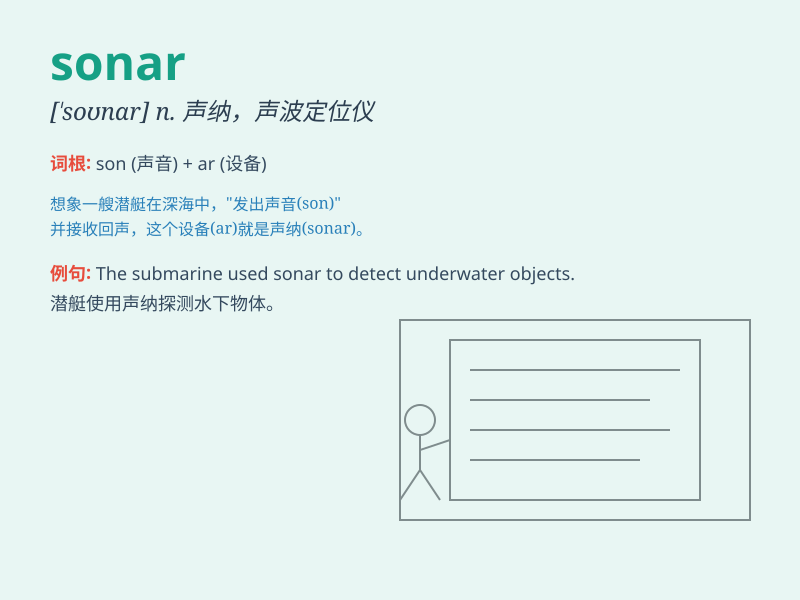

## sonar

**英音:** _[\'səʊnɑː]_ **美音:** _[\'sonɑr]_

**译义:** *n.声纳,声波定位仪*

### 短语

+ **sonar system:** _声纳系统_

+ **sonar equipment:** _声纳设备_

+ **sonar detector:** _声纳探测器_

+ **underwater sonar:** _水下声纳_

+ **shipborne sonar:** _舰载声纳_

### 例句

#### 例句1

> **The submarine uses sonar to detect other vessels.**

**中文翻译:** 这艘潜艇使用声呐来探测其他船只。

**单词释义:** 声呐

#### 例句2

> **The whale emits sounds that can be detected by sonar.**

**中文翻译:** 鲸鱼发出的声音可以被声呐探测到。

**单词释义:** 声呐

#### 例句3

> **The research team is developing a more advanced sonar system.**

**中文翻译:** 研究团队正在开发一种更先进的声呐系统。

**单词释义:** 声呐

### 背诵小故事

> A brave sailor was lost at sea. But with the help of sonar, which is
like a magic tool that sends and receives sounds underwater, they found
him. Sonar guided them safely back.

**一位勇敢的水手在海上迷失了。但借助声纳，这是一种在水下发送和接收声音的神奇工具，他们找到了他。声纳引导他们安全返回。**

### 图义

