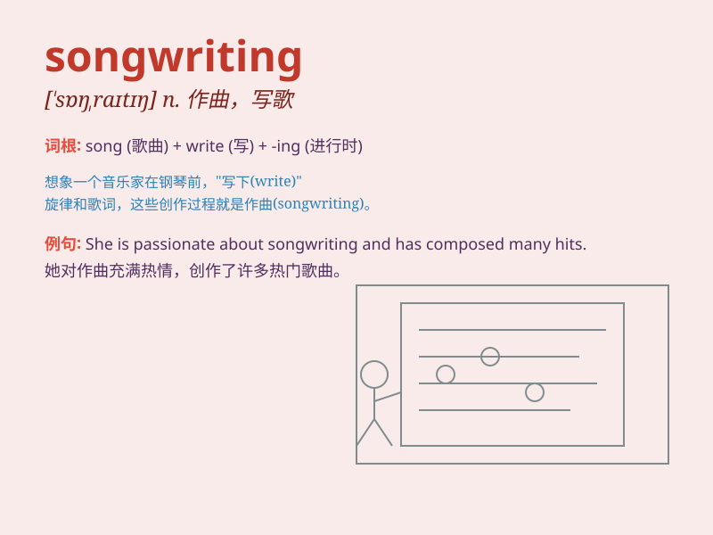

## songwriting

**英音:** _[ˈsɒŋˌraɪtɪŋ]_ **美音:** _[ˈsɔːŋˌraɪtɪŋ]_

**译义:** *n. 歌曲创作，写歌*

### 短语

+ **songwriting skills:** _歌曲创作技巧_

+ **professional songwriting:** _专业的歌曲创作_

+ **songwriting process:** _歌曲创作过程_

+ **talent for songwriting:** _歌曲创作天赋_

+ **songwriting inspiration:** _歌曲创作灵感_

### 例句

#### 例句1

> **His songwriting skills have earned him widespread
recognition.**

**中文翻译:** 他的歌曲创作技巧为他赢得了广泛的认可。

**单词释义:** 歌曲创作

#### 例句2

> **She is passionate about songwriting and spends hours every day
working on new compositions.**

**中文翻译:** 她热衷于歌曲创作，每天都会花几个小时创作新的作品。

**单词释义:** 歌曲创作

#### 例句3

> **The course focuses on developing students\' songwriting
abilities.**

**中文翻译:** 这门课程着重于培养学生的歌曲创作能力。

**单词释义:** 歌曲创作

### 背诵小故事

> A young musician had a dream of becoming a master of songwriting. One
day, inspiration struck and he composed a beautiful melody. With hard
work and passion, he mastered the art of songwriting and shared his
music with the world.

**一位年轻的音乐家梦想成为歌曲创作大师。有一天，灵感来袭，他创作出了一段优美的旋律。通过努力和热情，他掌握了歌曲创作的艺术，并与世界分享了他的音乐。**

### 图义

