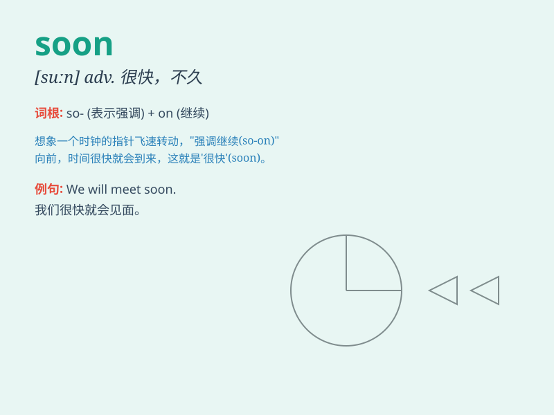

## soon

**英音:** _[suːn]_ **美音:** _[sun]_

**译义:** *adv.立刻,不久,快,早,宁愿*

### 短语

+ **as soon as:** _一\...\...就\...\..._

+ **soon after:** _不久之后_

+ **no sooner\...than\...:** _一\...\...就\...\..._

+ **sooner or later:** _迟早_

+ **the sooner, the better:** _越快越好_

### 例句

#### 例句1

> **I\'ll be back soon.**

**中文翻译:** 我很快就回来。

**单词释义:** 不久；很快；马上

#### 例句2

> **She will graduate soon.**

**中文翻译:** 她很快就要毕业了。

**单词释义:** 不久；很快；即将

#### 例句3

> **The train will arrive soon.**

**中文翻译:** 火车很快就到。

**单词释义:** 很快；即刻

### 背诵小故事

> One day, a little rabbit was very hungry. It asked its mom when it
could have dinner. Mom said, \'Soon, my dear. Just wait a little
while.\' So the rabbit knew it wouldn\'t be long before having a
delicious meal.

**有一天，一只小兔子非常饿。它问妈妈什么时候可以吃晚餐。妈妈说：'很快，亲爱的。只需再等一小会儿。'于是小兔子知道很快就能享用美味的一餐了。**

### 图义

