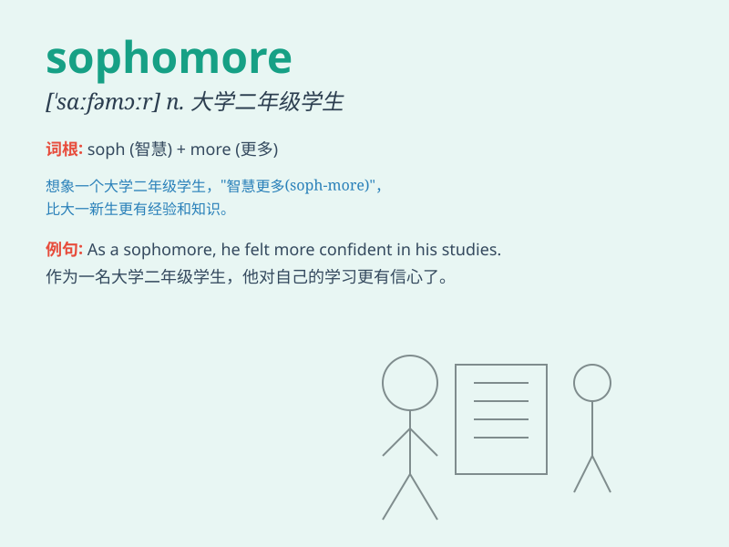

## sophomore

**英音:** _[\'sɒfəmɔː]_ **美音:** _[\'sɑfəmɔr]_

**译义:** *n.大学二年级生,有二年经验的人*

### 短语

+ **sophomore class:** _大学二年级班级_

+ **sophomore student:** _大学二年级学生_

+ **sophomore year:** _大学二年级_

+ **sophomore syndrome:**
_大二综合征（指大学二年级学生在学业、社交等方面出现的迷茫或困惑）_

+ **sophomore slump:**
_大二低谷（指大学二年级学生在学业成绩或个人发展方面出现的下滑）_

### 例句

#### 例句1

> **I\'m a sophomore in high school and I\'m really enjoying my
classes.**

**中文翻译:** 我是高中二年级的学生，我真的很喜欢我的课程。

**单词释义:** （高中、大学）二年级学生

#### 例句2

> **The sophomore album of the band was even more popular than the
first one.**

**中文翻译:** 这个乐队的第二张专辑比第一张更受欢迎。

**单词释义:** 第二年的；第二张的

#### 例句3

> **As a sophomore, she started to think about her future career.**

**中文翻译:** 作为一名大二学生，她开始思考自己未来的职业。

**单词释义:** （高中、大学）二年级学生

### 背诵小故事

> 想象一下，有个叫小明的学生，刚进入大学第二年，也就是 sophomore
年。他不再是新生时的懵懂，但也还没成为学长学姐那样成熟。这一年，他在学习和社交上都有新的挑战和成长。

**想象一个叫小明的学生处于大学第二年（大二）的情景，他面临新的挑战和成长。**

### 图义

