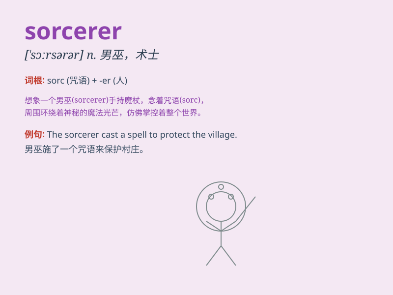

## sorcerer

**英音:** _[\'sɔːs(ə)rə]_ **美音:** _[\'sɔrsərɚ]_

**译义:** *n.男巫士,魔术师*

### 短语

+ **evil sorcerer:** _邪恶的巫师_

+ **powerful sorcerer:** _强大的巫师_

+ **ancient sorcerer:** _古老的巫师_

+ **mysterious sorcerer:** _神秘的巫师_

+ **wise sorcerer:** _睿智的巫师_

### 例句

#### 例句1

> **The sorcerer cast a powerful spell to protect the kingdom.**

**中文翻译:** 这位巫师施展了一个强大的咒语来保护王国。

**单词释义:** 巫师

#### 例句2

> **In the fairy tale, the sorcerer was defeated by the brave
knight.**

**中文翻译:** 在童话故事中，巫师被勇敢的骑士打败了。

**单词释义:** 巫师

#### 例句3

> **The sorcerer used his magic to turn the prince into a frog.**

**中文翻译:** 巫师用他的魔法把王子变成了一只青蛙。

**单词释义:** 巫师

### 背诵小故事

> Once upon a time, in a dark forest, there was a sorcerer. He had a
long beard and wore a black cloak. With his magic wand, he could control
the elements and cast powerful spells. But his power was used for good,
protecting the forest and its creatures.

**从前，在一片黑暗的森林里，有一个巫师。他留着长长的胡子，穿着黑色的斗篷。凭借他的魔杖，他能够控制元素并施展强大的法术。但他的力量用于行善，保护森林及其生物。**

### 图义

