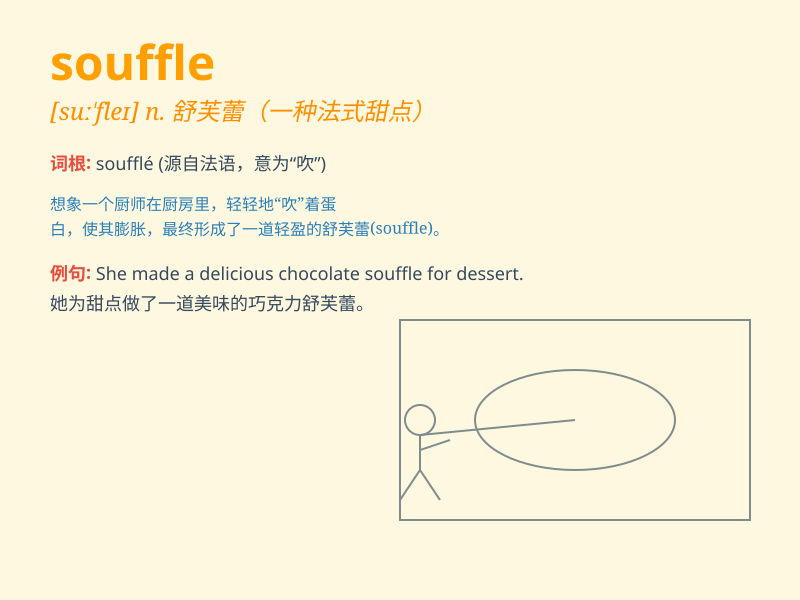

## souffle

**英音:** _[\'suːf(ə)l]_ **美音:** _[sʊ\'fle]_

**译义:** *n.[医]杂音,吹气音*

### 短语

+ **cheese souffle:** _奶酪蛋奶酥_

+ **chocolate souffle:** _巧克力蛋奶酥_

+ **lemon souffle:** _柠檬蛋奶酥_

+ **souffle dish:** _蛋奶酥烤盘_

+ **souffle recipe:** _蛋奶酥食谱_

### 例句

#### 例句1

> **The chef prepared a delicious chocolate souffle for dessert.**

**中文翻译:** 这位厨师准备了一份美味的巧克力蛋奶酥作为甜点。

**单词释义:** 蛋奶酥；舒芙蕾（一种松软的糕点）

#### 例句2

> **The souffle rose beautifully in the oven.**

**中文翻译:** 蛋奶酥在烤箱里膨胀得很漂亮。

**单词释义:** 蛋奶酥；舒芙蕾（一种松软的糕点）

#### 例句3

> **She attempted to make a cheese souffle but it didn\'t turn out
well.**

**中文翻译:** 她尝试做一个芝士蛋奶酥，但结果不太好。

**单词释义:** 蛋奶酥；舒芙蕾（一种松软的糕点）

### 背诵小故事

> A chef was making a special dish called souffle. It was a light and
fluffy pastry that needed to be baked carefully. If not, it might
collapse. Remember, souffle is this delicate and special pastry.

**一位厨师正在制作一种叫做蛋奶酥（souffle）的特殊菜肴。它是一种轻盈蓬松的糕点，需要小心烘焙。否则，它可能会塌陷。记住，souffle
就是这种精致又特别的糕点。**

### 图义

