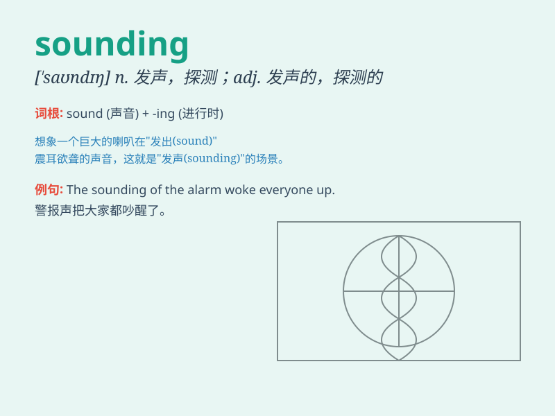

## sounding

**英音:** _[\'saʊndɪŋ]_ **美音:** _[\'saʊndɪŋ]_

**译义:** *n.探通术*

### 短语

+ **sounding board:** _参谋；征询意见的对象_

+ **sounding line:** _测深索_

+ **sounding rocket:** _探空火箭_

+ **sounding out:** _试探；探询_

+ **deep sounding:** _深层探测_

### 例句

#### 例句1

> **The sounding of the alarm woke everyone up.**

**中文翻译:** 警报的响声把每个人都吵醒了。

**单词释义:** 响声；发声

#### 例句2

> **His words had a hollow sounding.**

**中文翻译:** 他的话听起来很空洞。

**单词释义:** 听起来

#### 例句3

> **The doctor did a sounding of her lungs.**

**中文翻译:** 医生对她的肺部进行了探通。

**单词释义:** 探通；探测

### 背诵小故事

> A brave sailor was on a ship, using a special tool for sounding the
depth of the sea. He shouted, \'I\'m sounding to make sure we don\'t hit
any hidden rocks!\' It helped the ship sail safely.

**一位勇敢的水手在船上，使用一种特殊的工具来测量海的深度。他喊道：'我正在测量，以确保我们不会撞到任何隐藏的岩石！'这帮助船只安全航行。**

### 图义

