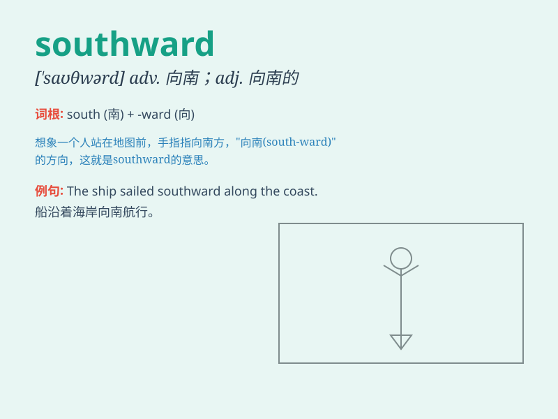

## southward

**英音:** _[\'saʊθwəd]_ **美音:** _[\'sʌðəd]_

**译义:** *adv.向南adj.向南的*

### 短语

+ **southward journey:** _向南的旅程_

+ **southward movement:** _向南的移动_

+ **southward direction:** _向南的方向_

+ **southward wind:** _南风_

+ **southward expansion:** _向南扩张_

### 例句

#### 例句1

> **The birds flew southward for the winter.**

**中文翻译:** 鸟儿向南飞去过冬。

**单词释义:** 向南

#### 例句2

> **We set off southward along the coast.**

**中文翻译:** 我们沿着海岸向南出发。

**单词释义:** 向南

#### 例句3

> **The river flows southward into the sea.**

**中文翻译:** 这条河向南流入大海。

**单词释义:** 向南

### 背诵小故事

> A brave explorer set off on a journey southward. He faced many
challenges but was determined to reach the unknown land in the south.
His southward adventure was full of excitement and discovery.

**一位勇敢的探险家踏上了向南的旅程。他面临许多挑战，但决心到达南方的未知之地。他向南的冒险充满了刺激和发现。**

### 图义

