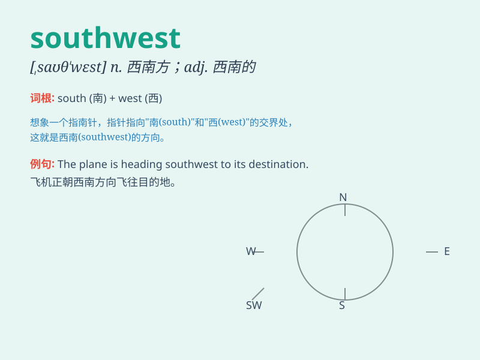

## southwest

**英音:** _[,saʊθ\'west]_ **美音:** _[,saʊθ\'wɛst]_

**译义:** *n.西南方adj.西南的,向西南方的*

### 短语

+ **southwest wind:** _西南风_

+ **southwest corner:** _西南角_

+ **southwest direction:** _西南方向_

+ **in the southwest:** _在西南部_

+ **southwest region:** _西南地区_

### 例句

#### 例句1

> **The plane is flying towards the southwest.**

**中文翻译:** 这架飞机正朝着西南方飞行。

**单词释义:** 西南方

#### 例句2

> **They decided to explore the southwest region of the country.**

**中文翻译:** 他们决定探索这个国家的西南部地区。

**单词释义:** 西南部

#### 例句3

> **The wind is blowing from the southwest.**

**中文翻译:** 风从西南方吹来。

**单词释义:** 西南方

### 背诵小故事

> One day, a brave explorer set off in the southwest direction. He
followed the setting sun and crossed rivers, finally discovering a
hidden treasure. Remember, southwest is the direction he went.

**有一天，一位勇敢的探险家朝着西南方向出发。他追随着落日，跨过河流，最终发现了一处隐藏的宝藏。记住，southwest
就是他所去的方向。**

### 图义

