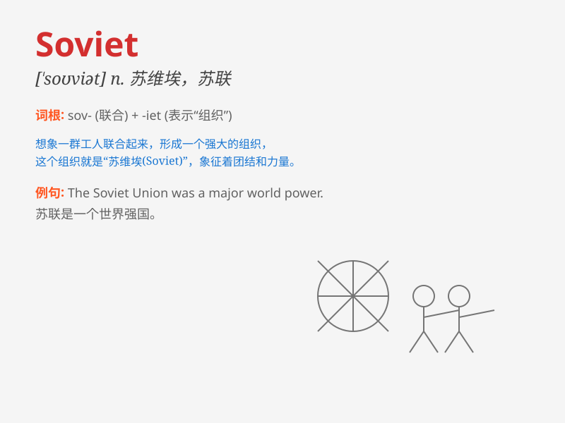

## Soviet

**英音:** _[ˈsəʊviət]_ **美音:** _[ˈsoʊviət]_

**译义:** *n.苏维埃；苏联人 adj.苏联的；苏维埃的*

### 短语

+ **Soviet Union:** _苏联_

+ **Soviet era:** _苏联时期_

+ **Soviet style:** _苏联风格_

+ **Soviet system:** _苏联体制_

+ **Soviet history:** _苏联历史_

### 例句

#### 例句1

> **The Soviet Union played a significant role in World War II.**

**中文翻译:** 苏联在第二次世界大战中发挥了重要作用。

**单词释义:** 苏联

#### 例句2

> **Soviet architecture was known for its grandiosity.**

**中文翻译:** 苏联建筑以其宏伟而闻名。

**单词释义:** 苏联的

#### 例句3

> **He studied the history of the Soviet period.**

**中文翻译:** 他研究了苏联时期的历史。

**单词释义:** 苏联的

### 背诵小故事

> Once upon a time, there was a land where people worked together for a
common goal. They called this land Soviet. It represented a group of
people united and striving for a better future.

**从前，有一片土地，那里的人们为了一个共同的目标而共同努力。他们把这片土地称为苏联。它代表着一群团结起来为更美好未来而奋斗的人们。**

### 图义

