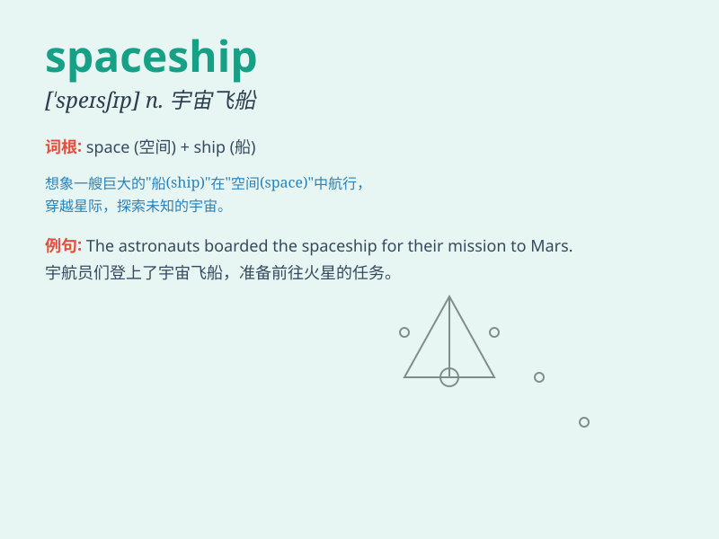

## spaceship

**英音:** _[\'speɪsʃɪp]_ **美音:** _[\'spesʃɪp]_

**译义:** *n.太空船*

### 短语

+ **manned spaceship:** _载人宇宙飞船_

+ **unmanned spaceship:** _无人驾驶宇宙飞船_

+ **space spaceship:** _太空飞船_

+ **experimental spaceship:** _实验性宇宙飞船_

+ **futuristic spaceship:** _未来主义的宇宙飞船_

### 例句

#### 例句1

> **The spaceship traveled through the galaxy at an incredible
speed.**

**中文翻译:** 这艘宇宙飞船以难以置信的速度穿越了星系。

**单词释义:** 宇宙飞船

#### 例句2

> **They are building a new type of spaceship for future space
exploration.**

**中文翻译:** 他们正在为未来的太空探索建造一种新型宇宙飞船。

**单词释义:** 宇宙飞船

#### 例句3

> **The spaceship landed safely on the distant planet.**

**中文翻译:** 宇宙飞船在遥远的星球上安全着陆。

**单词释义:** 宇宙飞船

### 背诵小故事

> One day, a little boy dreamed of traveling in a spaceship. He
imagined it flying through the vast universe, with shiny stars all
around. When he woke up, he remembered the word\'spaceship\' and its
meaning: a vehicle for traveling in space.

**有一天，一个小男孩梦到乘坐宇宙飞船旅行。他想象着它在浩瀚的宇宙中飞行，周围都是闪亮的星星。当他醒来，他记住了"spaceship"这个单词和它的意思：用于在太空旅行的交通工具。**

### 图义

