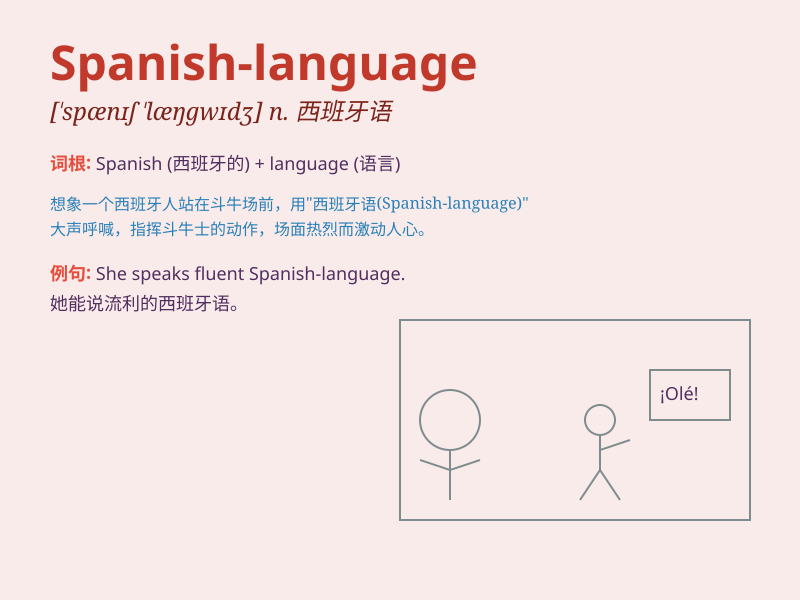

## Spanish-language

**英音:** _[ˈspænɪʃ ˈlæŋɡwɪdʒ]_ **美音:** _[ˈspænɪʃ
ˈlæŋɡwɪdʒ]_

**译义:** *adj. 西班牙语的；用西班牙语的 n. 西班牙语*

### 短语

+ **Spanish-language films:** _西班牙语电影_

+ **Spanish-language courses:** _西班牙语课程_

+ **Spanish-language media:** _西班牙语媒体_

+ **Spanish-language textbooks:** _西班牙语教材_

+ **Spanish-language websites:** _西班牙语网站_

### 例句

#### 例句1

> **I\'m studying Spanish-language literature at university.**

**中文翻译:** 我在大学里学习西班牙语语言文学。

**单词释义:** 西班牙语的

#### 例句2

> **The Spanish-language film won several awards.**

**中文翻译:** 这部西班牙语的电影获得了好几个奖项。

**单词释义:** 西班牙语的

#### 例句3

> **She is an expert in Spanish-language teaching methods.**

**中文翻译:** 她是西班牙语教学方法方面的专家。

**单词释义:** 西班牙语的

### 背诵小故事

> A girl was lost in a foreign city. She was relieved when she found a
Spanish-language bookstore. The friendly clerk helped her with
directions. She was so grateful and learned that knowing
Spanish-language could be a lifesaver.

**一个女孩在异国他乡迷路了。当她发现一家西班牙语书店时，她松了一口气。友好的店员给她指了路。她非常感激，并明白了懂西班牙语可能会救命。**

### 图义

