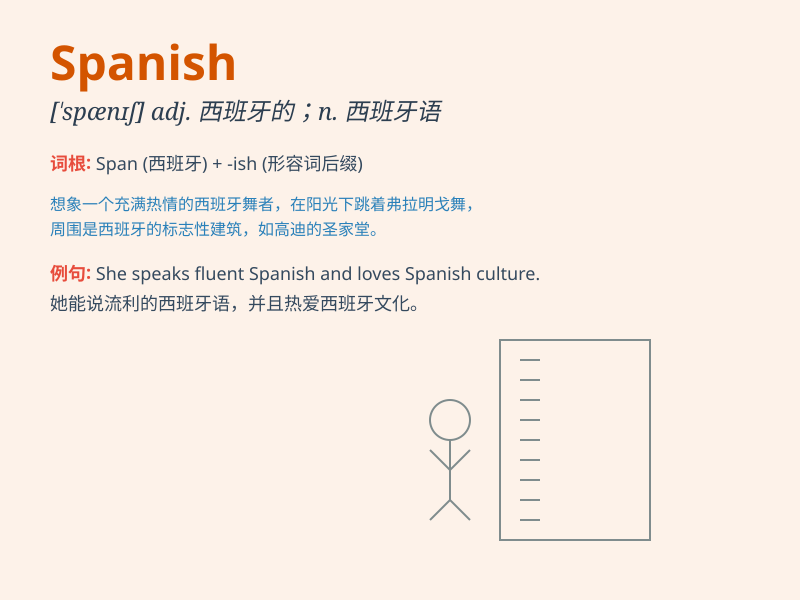

## Spanish

**英音:** _[ˈspænɪʃ]_ **美音:** _[ˈspænɪʃ]_

**译义:** *adj.西班牙的；西班牙人的；西班牙语的
n.西班牙语；西班牙人*

### 短语

+ **Spanish omelette:** _西班牙煎蛋卷_

+ **Spanish fly:** _西班牙芫菁；斑蝥_

+ **Spanish moss:** _铁兰；松萝凤梨_

+ **Spanish guitar:** _西班牙吉他_

+ **Spanish Main:**
_西班牙大陆美洲（指今中美洲和南美洲北部的沿海地区）_

### 例句

#### 例句1

> **I\'m learning Spanish at school.**

**中文翻译:** 我正在学校学习西班牙语。

**单词释义:** 西班牙语

#### 例句2

> **She has a Spanish friend.**

**中文翻译:** 她有一个西班牙朋友。

**单词释义:** 西班牙的

#### 例句3

> **The Spanish cuisine is very famous.**

**中文翻译:** 西班牙美食非常有名。

**单词释义:** 西班牙的

### 背诵小故事

> A young traveler was lost in a foreign city. When asked about his
nationality, he said, \'I\'m Spanish.\' But people didn\'t understand.
Finally, with gestures, he made them know he came from Spain.

**一位年轻的旅行者在外国城市迷路了。当被问及国籍时，他说：\'我是西班牙人。\'但人们不明白。最后，通过手势，他让他们知道他来自西班牙。**

### 图义

