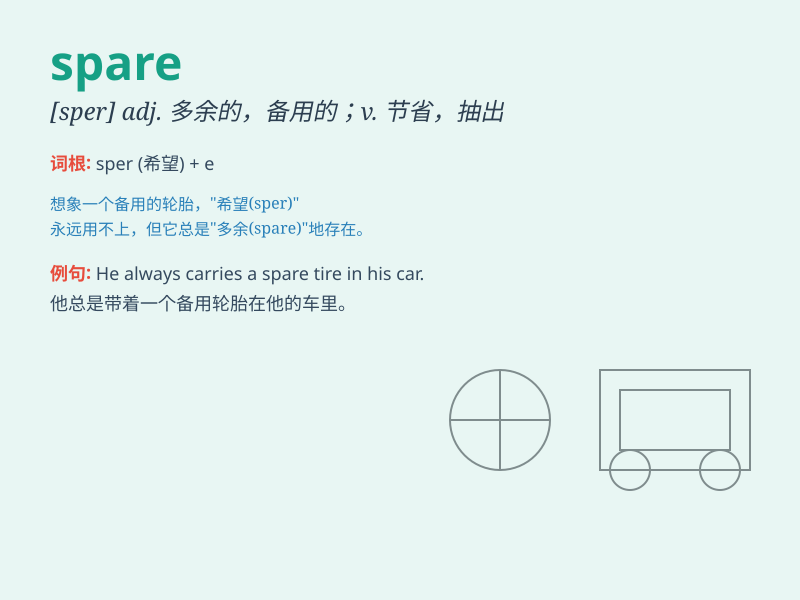

## spare

**英音:** _[speə]_ **美音:** _[spɛr]_

**译义:**
*adj.多余的,剩下的,高而瘦的人的,少量的,贫乏的,备用的v.节约,节省,不伤害,宽恕,分让,提供给某人*

### 短语

+ **spare time:** _业余时间；空闲时间_

+ **spare no effort:** _不遗余力；竭尽全力_

+ **spare part:** _备件；零件_

+ **spare someone\'s feelings:** _不伤害某人的感情_

+ **spare change:** _零钱；多余的零钱_

### 例句

#### 例句1

> **I have no spare time this weekend.**

**中文翻译:** 这个周末我没有空闲时间。

**单词释义:** 空闲的；多余的

#### 例句2

> **Could you spare me a few minutes?**

**中文翻译:** 你能抽出我几分钟时间吗？

**单词释义:** 抽出；匀出

#### 例句3

> **We have a spare bedroom that can be used as a guest room.**

**中文翻译:** 我们有一间备用卧室，可以用作客房。

**单词释义:** 空着的；闲置的

### 背诵小故事

> A king had many spare rooms in his castle. One day, a poor traveler
asked for a place to stay. The kind king spared a room for him. The
traveler was very grateful.

**一位国王在他的城堡里有很多空闲的房间。有一天，一个贫穷的旅行者请求借住。善良的国王腾出一间给他。旅行者非常感激。**

### 图义

