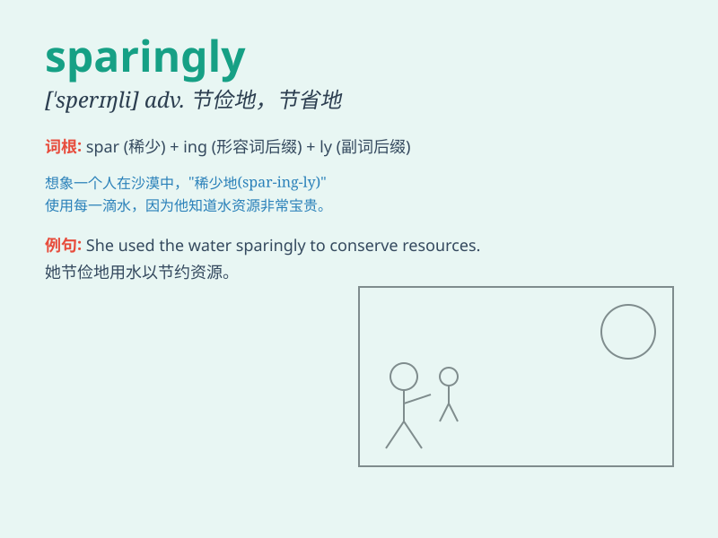

## sparingly

**英音:** _[\'speərɪŋli]_ **美音:** _[\'sperɪŋli]_

**译义:** *adv.节俭地,保守地*

### 短语

+ **use sparingly:** _少量使用_

+ **apply sparingly:** _少量涂抹；谨慎应用_

+ **spend sparingly:** _节俭花费_

+ **distribute sparingly:** _少量分配_

+ **consume sparingly:** _少量消费_

### 例句

#### 例句1

> **She uses salt sparingly when cooking to maintain a healthy
diet.**

**中文翻译:** 她做饭时很少用盐，以保持健康的饮食习惯。

**单词释义:** 少量地；节俭地

#### 例句2

> **The company distributes bonuses sparingly to its employees.**

**中文翻译:** 该公司很少向员工发放奖金。

**单词释义:** 吝啬地；节俭地

#### 例句3

> **He applied the paint sparingly to the canvas, creating a unique
texture.**

**中文翻译:** 他将颜料少量地涂在画布上，创造出独特的纹理。

**单词释义:** 节省地；谨慎地

### 背诵小故事

> A king was very sparingly giving rewards to his knights. He was
cautious and gave them only when it was truly deserved. This shows how
\'sparingly\' means in a limited or frugal way.

**一位国王在给他的骑士们赏赐时非常吝啬。他很谨慎，只有在真正应得的时候才给。这表明了\'sparingly\'意思是以有限或节俭的方式。**

### 图义

