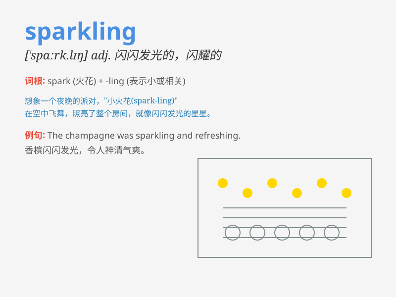

## sparkling

**英音:** _[\'spɑːk(ə)lɪŋ; \'spɑːklɪŋ]_ **美音:**
_[\'spɑrklɪŋ]_

**译义:** *adj.闪烁的,闪闪发光的,发泡的*

### 短语

+ **sparkling water:** _气泡水；苏打水_

+ **sparkling wine:** _起泡酒；汽酒_

+ **sparkling eyes:** _炯炯有神的眼睛；闪闪发光的眼睛_

+ **sparkling gem:** _闪闪发光的宝石_

+ **sparkling conversation:** _妙趣横生的谈话；精彩的交谈_

### 例句

#### 例句1

> **The wine is sparkling and refreshing.**

**中文翻译:** 该酒起泡且清爽。

**单词释义:** 闪闪发光的

#### 例句2

> **She wore a sparkling diamond necklace.**

**中文翻译:** 她戴着一条闪闪发光的钻石项链。

**单词释义:** 闪闪发光的

#### 例句3

> **The stars were sparkling in the clear sky.**

**中文翻译:** 星星在晴朗的天空中闪闪发光。

**单词释义:** 闪烁的

### 背诵小故事

> Once upon a time, at a party, I opened a bottle of champagne. The
liquid inside was sparkling like countless stars. It was so beautiful
and made the party more enjoyable.

**从前，在一次聚会上，我打开了一瓶香槟。里面的液体像无数颗星星一样闪闪发光。它是如此美丽，让聚会更加愉快。**

### 图义

