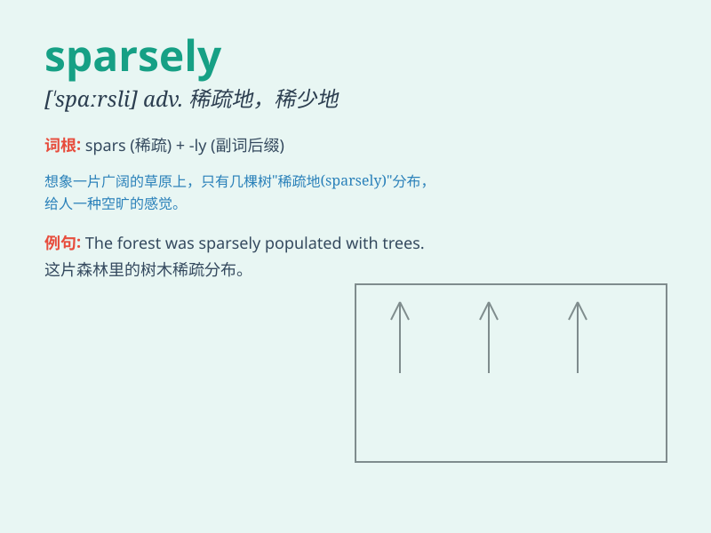

## sparsely

**英音:** _[spɑ:slɪ]_ **美音:** _[ˈspɑrslɪ]_

**译义:** *adv.稀疏地,稀少地*

### 短语

+ **sparsely populated:** _人口稀少的_

+ **sparsely furnished:** _陈设简陋的_

+ **sparsely distributed:** _分布稀疏的_

+ **sparsely haired:** _头发稀疏的_

+ **sparsely attended:** _参加者稀少的_

### 例句

#### 例句1

> **The countryside is sparsely populated.**

**中文翻译:** 农村人烟稀少。

**单词释义:** 稀少地

#### 例句2

> **The bookshelf was sparsely filled with a few old books.**

**中文翻译:** 书架上稀疏地堆满了几本旧书。

**单词释义:** 稀疏地

#### 例句3

> **The stars were sparsely scattered across the sky.**

**中文翻译:** 星星稀疏地散布在天空中。

**单词释义:** 零星地

### 背诵小故事

> In a faraway land, there was a forest. But the trees were sparsely
distributed. Only a few could be seen here and there. It made the forest
seem lonely and empty.

**在一片遥远的土地上，有一片森林。但是树木分布得很稀疏。到处只能看到寥寥几棵。这让森林显得孤寂又空旷。**

### 图义

