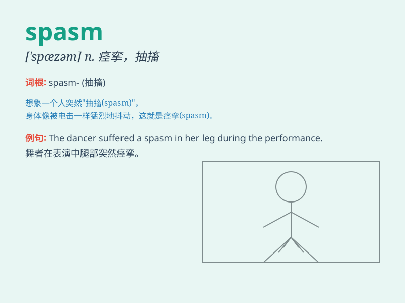

## spasm

**英音:** _[\'spæz(ə)m]_ **美音:** _[\'spæzəm]_

**译义:** *n.(感情等)一阵发作,痉挛*

### 短语

+ **muscle spasm:** _肌肉痉挛_

+ **vascular spasm:** _血管痉挛_

+ **spasm of pain:** _一阵疼痛_

+ **intestinal spasm:** _肠痉挛_

+ **bronchial spasm:** _支气管痉挛_

### 例句

#### 例句1

> **He suffered from a spasm in his leg muscle.**

**中文翻译:** 他的腿部肌肉痉挛。

**单词释义:** 痉挛；抽搐

#### 例句2

> **The patient had a spasm of coughing.**

**中文翻译:** 病人出现痉挛性咳嗽。

**单词释义:** （身体某部位的）痉挛；抽搐；阵发

#### 例句3

> **A spasm of pain crossed her face.**

**中文翻译:** 她的脸上掠过一丝痛苦。

**单词释义:** （疼痛等的）一阵发作

### 背诵小故事

>
想象一个人在寒冷的冬天掉进了冰窟窿，他的身体突然不受控制地颤抖，肌肉一阵一阵地收缩，这种强烈的、突然的肌肉收缩就像是\'spasm\'。

**想象一个人掉进冰窟窿，身体突然颤抖，肌肉收缩的情况来辅助记忆\'spasm\'（痉挛；抽搐）这个单词**

### 图义

