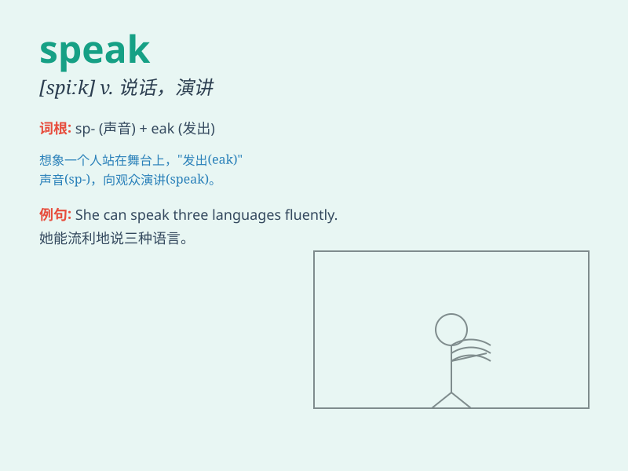

## speak

**英音:** _[spiːk]_ **美音:** _[spik]_

**译义:** *v.说话,谈话,说明事实,表示意见,发言,演讲,操(某种语言)*

### 短语

+ **speak out:** _畅所欲言；大胆地说_

+ **speak up:** _大声说；表态_

+ **speak of:** _谈到；提及_

+ **speak for:** _代表...讲话；为...辩护_

+ **generally speaking:** _一般而言；总的来说_

### 例句

#### 例句1

> **She speaks English fluently.**

**中文翻译:** 她英语说得很流利。

**单词释义:** 说（某种语言）

#### 例句2

> **He refused to speak about the incident.**

**中文翻译:** 他拒绝谈论这起事件。

**单词释义:** 谈论；提及

#### 例句3

> **The child is learning to speak.**

**中文翻译:** 孩子正在学说话。

**单词释义:** 说话；讲话

### 背诵小故事

> One day, a little mouse was very scared. But when it saw a big cat,
it bravely spoke to the cat and said, \'I\'m not afraid of you!\' Here,
\'speak\' means to express thoughts or words.

**有一天，一只小老鼠非常害怕。但当它看到一只大猫时，它勇敢地对猫说话并说道：'我不怕你！'这里，'speak'意思是表达想法或说出话语。**

### 图义

