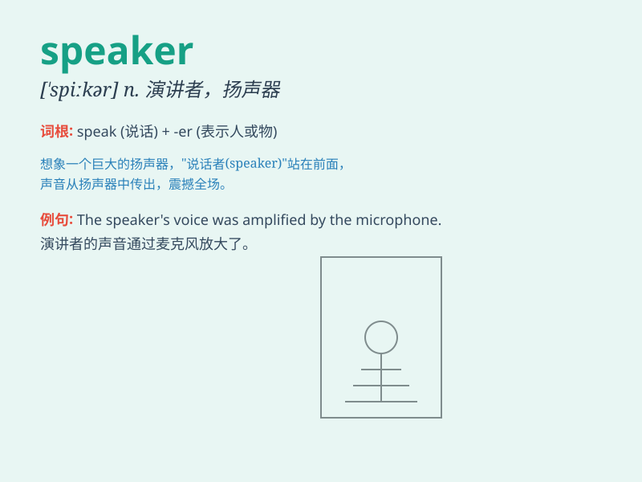

## speaker

**英音:** _[\'spiːkə]_ **美音:** _[\'spikɚ]_

**译义:** *n.说话者,演讲人,演说者,扬声器,喇叭*

### 短语

+ **public speaker:** _演说家；演讲者_

+ **guest speaker:** _特邀演讲者；客座演讲人_

+ **native speaker:** _说本族语的人；母语使用者_

+ **loudspeaker:** _扬声器；喇叭_

+ **speaker system:** _扬声器系统_

### 例句

#### 例句1

> **The speaker at the conference was very knowledgeable.**

**中文翻译:** 会议上的演讲者知识渊博。

**单词释义:** 演讲者；说话者

#### 例句2

> **The speaker of the parliament delivered an important speech.**

**中文翻译:** 议长发表重要讲话。

**单词释义:** 议长

#### 例句3

> **The speakers on my computer aren\'t working properly.**

**中文翻译:** 我的计算机上的扬声器无法正常工作。

**单词释义:** 扬声器

### 背诵小故事

> A king was looking for a speaker to tell stories at night. Many tried
but failed. Finally, a young man with a charming voice was chosen. The
king was very happy and called him the best speaker.

**一位国王正在寻找一位能在晚上讲故事的演讲者。许多人尝试了但都失败了。最后，一位有着迷人嗓音的年轻人被选中了。国王非常高兴，称他为最好的演讲者。**

### 图义

