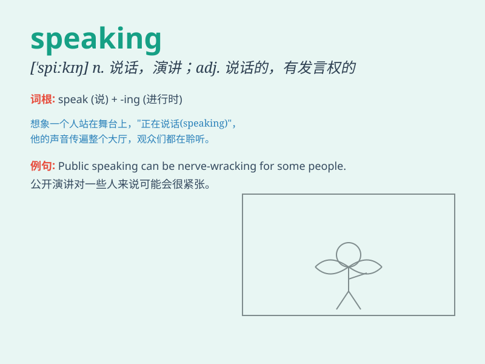

## speaking

**英音:** _[\'spiːkɪŋ]_ **美音:** _[\'spikɪŋ]_

**译义:** *n.谈话,演讲adj.讲话的,适于说的,象要开口似的*

### 短语

+ **public speaking:** _公开演讲_

+ **speaking skills:** _演讲技巧；说话技巧_

+ **speaking part:** _台词；对白部分_

+ **speaking of:** _说到；谈及_

+ **free speaking:** _自由发言；自由讲话_

### 例句

#### 例句1

> **She is good at public speaking.**

**中文翻译:** 她擅长公开演讲。

**单词释义:** 演讲；发言

#### 例句2

> **I\'m not very confident when it comes to speaking in English.**

**中文翻译:** 我对说英语不太有信心。

**单词释义:** 讲话；说话

#### 例句3

> **He has a talent for speaking persuasively.**

**中文翻译:** 他有说服力的演讲天赋。

**单词释义:** 说；讲

### 背诵小故事

> One day, I was in a library and saw a girl speaking loudly. The
librarian came and reminded her to keep quiet. I learned that speaking
politely and softly is important in public places.

**一天，我在图书馆看到一个女孩大声说话。图书管理员过来提醒她保持安静。我明白了在公共场所礼貌、轻声说话很重要。**

### 图义

