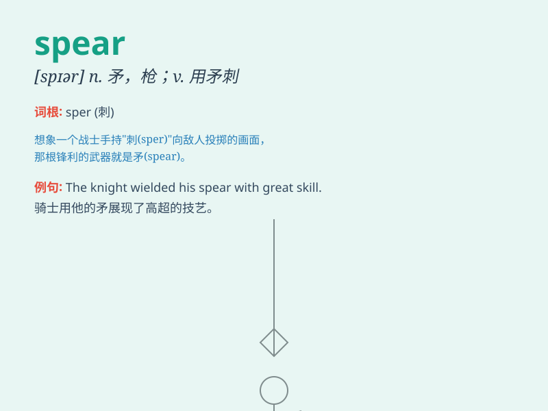

## spear

**英音:** _[spɪə]_ **美音:** _[spɪr]_

**译义:** *n.矛,枪*

### 短语

+ **spear fishing:** _用鱼叉捕鱼_

+ **spear point:** _矛头；枪尖_

+ **spear thrower:** _投矛器_

+ **spear grass:** _针茅_

+ **spear carrier:** _（戏剧、电影中的）龙套角色_

### 例句

#### 例句1

> **The warrior brandished his spear and charged into battle.**

**中文翻译:** 战士挥舞着长矛，冲锋在前。

**单词释义:** 长矛

#### 例句2

> **The fisherman used a spear to catch fish in the river.**

**中文翻译:** 渔夫用矛在河里捕鱼。

**单词释义:** 鱼叉

#### 例句3

> **The sharp spear pierced through the enemy\'s shield.**

**中文翻译:** 锋利的长矛刺穿了敌人的盾牌。

**单词释义:** 长矛

### 背诵小故事

> A brave warrior was in a battle. When the enemy charged, he quickly
grabbed his spear and lunged forward with all his might. The sharp tip
of the spear pierced the enemy\'s shield. With the spear, he protected
his people and won the fight.

**一位勇敢的战士正在战斗。当敌人冲锋时，他迅速抓起他的长矛，全力向前刺去。长矛锋利的尖端刺穿了敌人的盾牌。凭借长矛，他保护了自己的人民并赢得了战斗。**

### 图义

