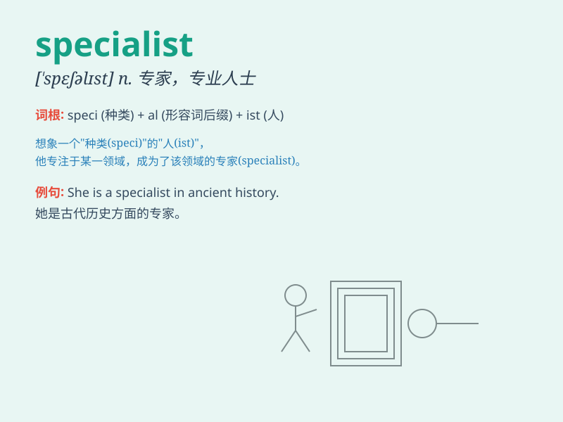

## specialist

**英音:** _[\'speʃ(ə)lɪst]_ **美音:** _[\'spɛʃəlɪst]_

**译义:** *n.专门医师,专家*

### 短语

+ **medical specialist:** _医学专家_

+ **marketing specialist:** _营销专家_

+ **language specialist:** _语言专家_

+ **financial specialist:** _金融专家_

+ **IT specialist:** _信息技术专家_

### 例句

#### 例句1

> **She\'s a specialist in heart diseases.**

**中文翻译:** 她是心脏病专家。

**单词释义:** 专家

#### 例句2

> **The company hired a marketing specialist to boost sales.**

**中文翻译:** 该公司聘请了一位营销专家来促进销售。

**单词释义:** 专家

#### 例句3

> **We need to consult a tax specialist for this complex issue.**

**中文翻译:** 对于这个复杂的问题，我们需要咨询税务专家。

**单词释义:** 专家

### 背诵小故事

> Once upon a time, in a big hospital, there was a doctor. He wasn\'t
an ordinary doctor; he was a specialist in heart diseases. People came
from far and wide to seek his expert help. He was known for his special
skills and knowledge.

**从前，在一家大医院里，有一位医生。他不是普通的医生，而是一位心脏病专家。人们从四面八方赶来寻求他的专业帮助。他以其特殊的技能和知识而闻名。**

### 图义

