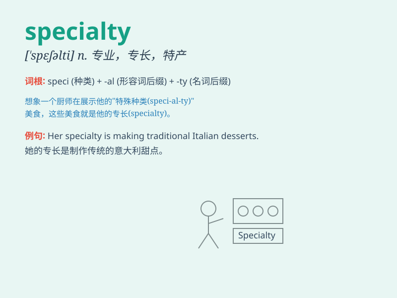

## specialty

**英音:** _[\'speʃ(ə)ltɪ]_ **美音:** _[\'spɛʃəlti]_

**译义:** *n.专业*

### 短语

+ **medical specialty:** _医学专业_

+ **area of specialty:** _专业领域_

+ **unique specialty:** _独特专长_

+ **professional specialty:** _职业专长_

+ **core specialty:** _核心专业_

### 例句

#### 例句1

> **His specialty is heart surgery.**

**中文翻译:** 他的专长是心脏外科。

**单词释义:** 专长；专业

#### 例句2

> **The local bakery\'s specialty is chocolate croissants.**

**中文翻译:** 当地面包店的特色菜是巧克力羊角面包。

**单词释义:** 特色

#### 例句3

> **What\'s your specialty in the field of computer science?**

**中文翻译:** 您在计算机科学领域的专业是什么？

**单词释义:** 专业

### 背诵小故事

> One day, Tom was at a food fair. He found a stall selling unique
cookies. These cookies were the specialty of the stall. They were so
delicious that Tom couldn\'t forget them. Specialty means a special or
unique product or skill.

**有一天，汤姆在一个美食集市上。他发现一个摊位在卖独特的饼干。这些饼干是这个摊位的特色。它们太美味了，让汤姆难以忘怀。specialty
意思是特色、专长。**

### 图义

