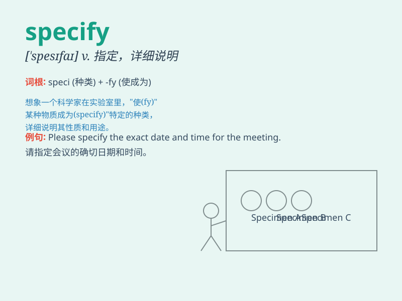

## specify

**英音:** _[\'spesɪfaɪ]_ **美音:** _[\'spɛsɪfaɪ]_

**译义:** *vt.指定,详细说明,列入清单*

### 短语

+ **specify clearly:** _明确说明_

+ **specify precisely:** _精确指定_

+ **specify in detail:** _详细说明_

+ **specify exactly:** _确切指明_

+ **specify particularly:** _特别指明_

### 例句

#### 例句1

> **Please specify the requirements clearly.**

**中文翻译:** 请明确要求。

**单词释义:** 明确说明；具体指明

#### 例句2

> **The contract failed to specify the delivery date.**

**中文翻译:** 合同未能明确交货日期。

**单词释义:** 明确；具体指出

#### 例句3

> **Can you specify which color you prefer?**

**中文翻译:** 您能指定您喜欢哪种颜色吗？

**单词释义:** 详细说明；具体说明

### 背诵小故事

> A scientist was asked to specify the details of a new experiment. He
carefully wrote down every step and requirement, making sure nothing was
left unclear. By specifying precisely, the success of the experiment was
ensured.

**一位科学家被要求明确一个新实验的细节。他仔细地写下每一个步骤和要求，确保没有任何不清楚的地方。通过精确地指明，实验的成功得到了保证。**

### 图义

