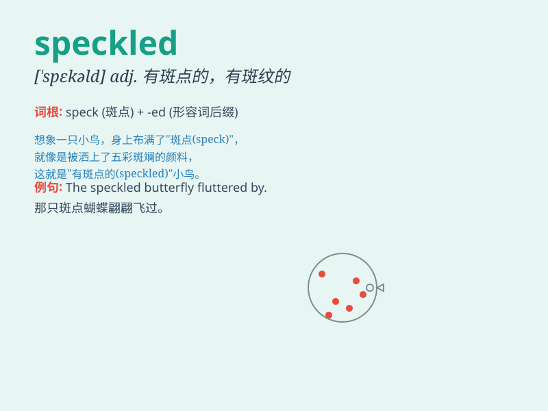

## speckled

**英音:** _[ˈspekld]_ **美音:** _[ˈspekld]_

**译义:** *adj.有斑点的,如斑点般散布的,混杂的*

### 短语

+ **speckled trout:** _花斑鳟鱼_

+ **speckled egg:** _有斑点的蛋_

+ **speckled pattern:** _斑点图案_

+ **speckled skin:** _有斑点的皮肤_

+ **speckled plumage:** _有斑点的羽毛_

### 例句

#### 例句1

> **The hen has speckled feathers.**

**中文翻译:** 母鸡的羽毛上有斑点。

**单词释义:** 有斑点的

#### 例句2

> **The sky was speckled with stars.**

**中文翻译:** 天空布满了星星。

**单词释义:** 布满

#### 例句3

> **The eggs were speckled brown and white.**

**中文翻译:** 鸡蛋有棕色和白色斑点。

**单词释义:** 有斑点的

### 背诵小故事

> A little bird was flying in the sky. Its feathers were speckled with
various colors, like tiny dots of paint. When it landed on a branch,
people were amazed by its beautiful speckled appearance.

**一只小鸟在天空飞翔。它的羽毛布满了各种颜色的斑点，就像小小的颜料点。当它落在树枝上时，人们都为它美丽的斑点外表感到惊奇。**

### 图义

