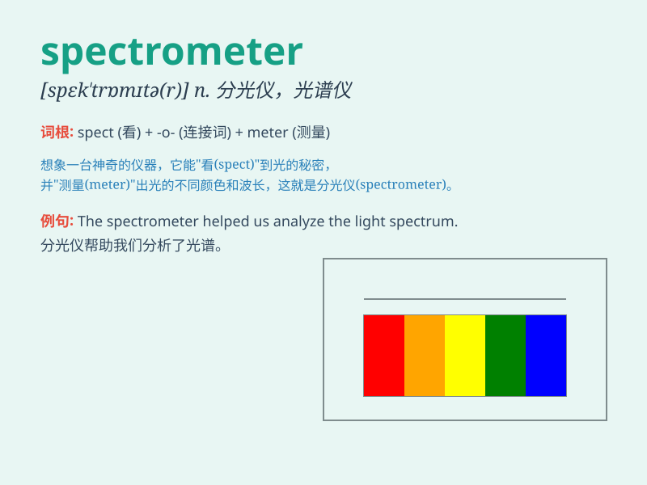

## spectrometer

**英音:** _[spek\'trɒmɪtə]_ **美音:** _[spɛk\'trɑmɪtɚ]_

**译义:** *n.[物]分光计*

### 短语

+ **mass spectrometer:** _质谱仪_

+ **optical spectrometer:** _光学光谱仪_

+ **atomic spectrometer:** _原子光谱仪_

+ **infrared spectrometer:** _红外光谱仪_

+ **gamma-ray spectrometer:** _伽马射线光谱仪_

### 例句

#### 例句1

> **The spectrometer is used to analyze the composition of
materials.**

**中文翻译:** 光谱仪用于分析材料的成分。

**单词释义:** 分光计；分光仪

#### 例句2

> **The scientist operated the spectrometer with great care.**

**中文翻译:** 这位科学家非常小心地操作光谱仪。

**单词释义:** 分光计；分光仪

#### 例句3

> **The new spectrometer provides more accurate data than the old
one.**

**中文翻译:** 新的光谱仪比旧的光谱仪提供更准确的数据。

**单词释义:** 分光计；分光仪

### 背诵小故事

> One day, a scientist was using a special tool called a spectrometer
to analyze the light from a distant star. The spectrometer helped him
understand the star\'s composition, like a magic key unlocking the
secrets of the universe.

**有一天，一位科学家正在使用一种叫做分光计的特殊工具来分析来自遥远恒星的光。分光计帮助他了解恒星的成分，就像一把神奇的钥匙，解开了宇宙的秘密。**

### 图义

