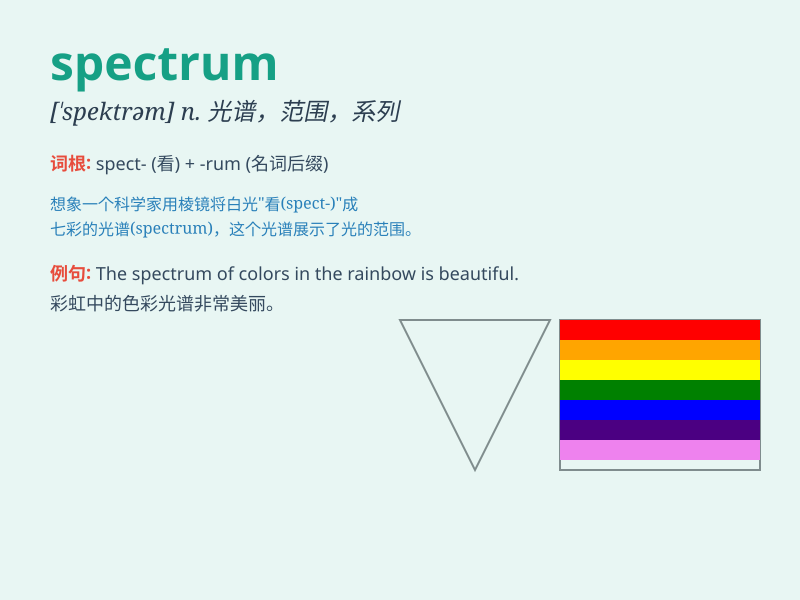

## spectrum

**英音:** _[\'spektrəm]_ **美音:** _[\'spɛktrəm]_

**译义:** *n.光,光谱,型谱 频谱*

### 短语

+ **electromagnetic spectrum:** _电磁频谱_

+ **visible spectrum:** _可见光谱_

+ **spectrum analysis:** _光谱分析_

+ **frequency spectrum:** _频谱_

+ **color spectrum:** _色谱_

### 例句

#### 例句1

> **The visible light spectrum ranges from violet to red.**

**中文翻译:** 可见光谱范围从紫色到红色。

**单词释义:** 光谱

#### 例句2

> **The political spectrum in this country is very diverse.**

**中文翻译:** 这个国家的政治派别非常多元化。

**单词释义:** 范围；系列

#### 例句3

> **His musical tastes cover a wide spectrum.**

**中文翻译:** 他的音乐品味涵盖广泛。

**单词释义:** 范围；领域

### 背诵小故事

>
想象你在一个神秘的实验室，里面有各种颜色的光线。这些光线从红色到紫色依次排列，形成了一个像彩虹一样的带，这就是\'spectrum\'（光谱）。它代表着光的不同颜色和频率的范围。

**想象你在实验室看到从红到紫的光线形成的带，这就是光谱，代表光的不同颜色和频率范围。**

### 图义

