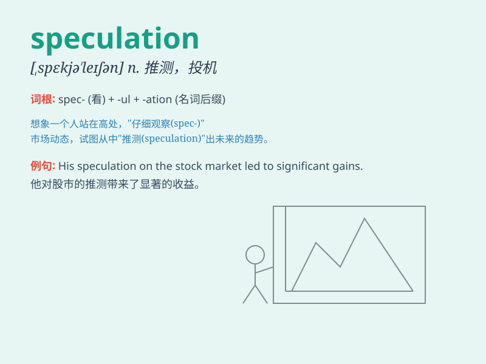

## speculation

**英音:** _[,spekjʊ\'leɪʃn]_ **美音:**
_[,spɛkju\'leʃən]_

**译义:** *n.思索,做投机买卖*

### 短语

+ **speculation about:** _关于\...\...的猜测_

+ **financial speculation:** _金融投机_

+ **wild speculation:** _胡乱猜测_

+ **speculation in stocks:** _股票投机_

+ **groundless speculation:** _毫无根据的猜测_

### 例句

#### 例句1

> **There has been a lot of speculation about the cause of the
accident.**

**中文翻译:** 关于事故原因，外界有多种猜测。

**单词释义:** 猜测；推测

#### 例句2

> **His success is the subject of much speculation.**

**中文翻译:** 他的成功引起了很多猜测。

**单词释义:** 猜测；推测

#### 例句3

> **Speculation was rife that she was going to resign.**

**中文翻译:** 人们普遍猜测她将辞职。

**单词释义:** 猜测；推测

### 背诵小故事

> A smart investor made a lot of money through speculation. He
carefully studied market trends, guessed the future prices of stocks,
and took risks. His success showed that speculation needs both knowledge
and courage.

**一位聪明的投资者通过投机赚了很多钱。他仔细研究市场趋势，猜测股票的未来价格，并勇于冒险。他的成功表明投机既需要知识也需要勇气。**

### 图义

