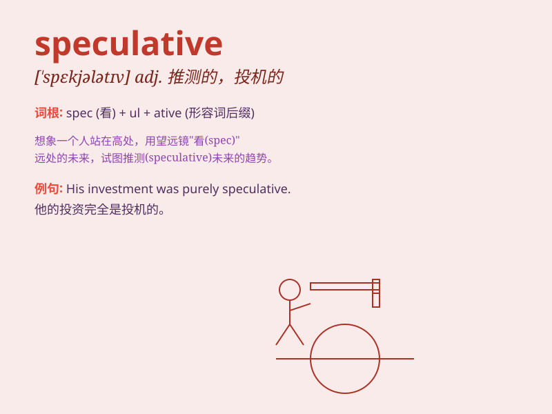

## speculative

**英音:** _[\'spekjʊlətɪv]_ **美音:** _[\'spɛkjələtɪv]_

**译义:** *adj.投机的*

### 短语

+ **speculative investment:** _投机性投资_

+ **speculative theory:** _推测性理论_

+ **speculative business:** _投机生意_

+ **speculative market:** _投机市场_

+ **speculative venture:** _投机性冒险_

### 例句

#### 例句1

> **His investment decisions were often speculative and risky.**

**中文翻译:** 他的投资决策往往具有投机性和风险性。

**单词释义:** 投机性的

#### 例句2

> **The article presented a speculative theory about the origin of
the universe.**

**中文翻译:** 这篇文章提出了关于宇宙起源的推测理论。

**单词释义:** 推测性的

#### 例句3

> **She made a speculative guess as to the outcome of the race.**

**中文翻译:** 她对比赛的结果做出了推测。

**单词释义:** 推测性的

### 背诵小故事

> A detective was working on a speculative case. He had only clues and
guesses. But with his sharp mind, he finally found the truth.
\'Speculative\' means based on guesses and not certain facts.

**一位侦探正在处理一个推测性的案件。他只有线索和猜测。但凭借敏锐的头脑，他最终找到了真相。\'speculative\'意思是基于猜测而非确定的事实。**

### 图义

