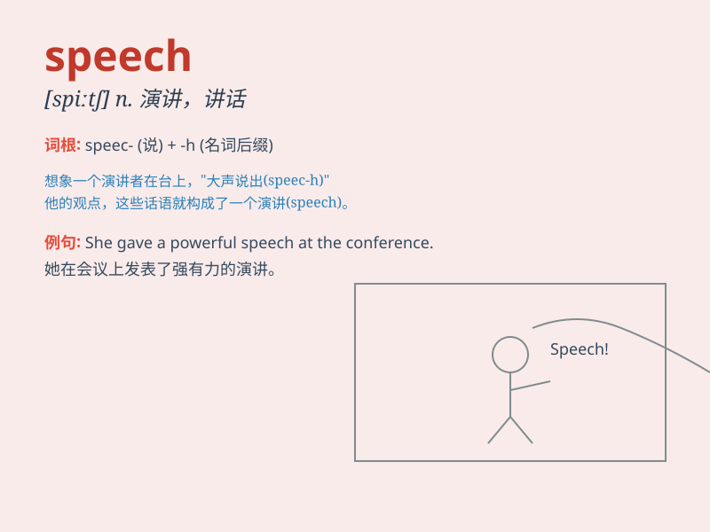

## speech

**英音:** _[spiːtʃ]_ **美音:** _[spitʃ]_

**译义:** *n.演说,讲话 语音*

### 短语

+ **make a speech:** _发表演讲_

+ **freedom of speech:** _言论自由_

+ **speech contest:** _演讲比赛_

+ **speech therapy:** _言语治疗_

+ **speech recognition:** _语音识别_

### 例句

#### 例句1

> **His speech was very inspiring.**

**中文翻译:** 他的讲话非常鼓舞人心。

**单词释义:** 演讲

#### 例句2

> **She lost her speech after the accident.**

**中文翻译:** 事故发生后她失去了言语能力。

**单词释义:** 说话能力

#### 例句3

> **The politician\'s speech was full of empty promises.**

**中文翻译:** 这位政客的讲话充满了空洞的承诺。

**单词释义:** 演说

### 背诵小故事

> A king was giving a speech to his people. But suddenly, a bird flew
over and made a funny noise. Everyone laughed, but the king continued
his speech bravely.

**一位国王正在向他的子民发表演讲。但突然，一只鸟飞过来并发出了滑稽的声音。大家都笑了，但国王勇敢地继续他的演讲。**

### 图义

