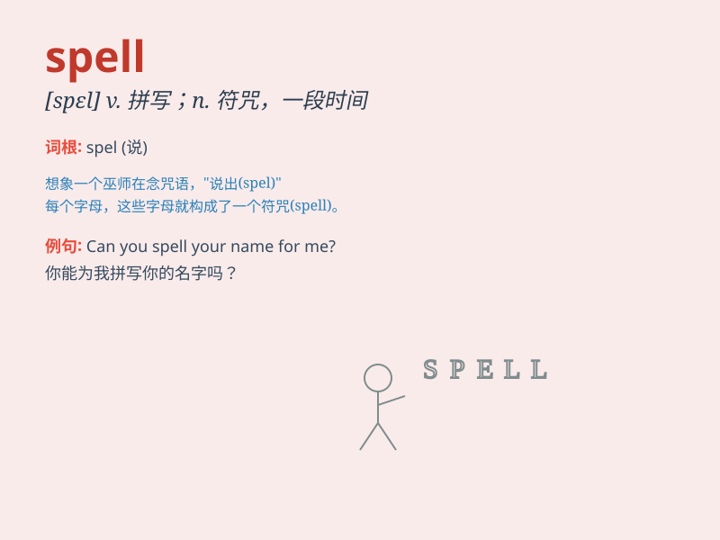

## spell

**英音:** _[spel]_ **美音:** _[spɛl]_

**译义:**
*n.符咒,魅力,一段时间,轮班vt.拼写,拼成,意味着,轮值,招致,迷住vi.轮替,拼字*

### 短语

+ **spell out:** _详细说明；讲清楚_

+ **under a spell:** _被迷住；被符咒镇住_

+ **spell trouble:** _预示有麻烦_

+ **cast a spell:** _施魔法；念咒语_

+ **take spells:** _轮流；轮班_

### 例句

#### 例句1

> **Can you spell your name for me?**

**中文翻译:** 你能帮我拼写一下你的名字吗？

**单词释义:** 拼写

#### 例句2

> **The witch\'s spell made the prince fall asleep.**

**中文翻译:** 女巫的咒语让王子睡着了。

**单词释义:** 咒语

#### 例句3

> **This cold spell is rather unusual for this time of year.**

**中文翻译:** 对于一年中的这个时候来说，这次寒流是相当不寻常的。

**单词释义:** 一段寒冷的天气

### 背诵小故事

> Once upon a time, a little witch needed to SPELL a magic word to turn
a frog into a prince. She carefully pronounced each letter and finally
made the magic happen. So, remember, \'spell\' means to form words by
saying or writing the letters.

**从前，有一个小女巫需要拼出一个魔法单词把青蛙变成王子。她仔细地念出每个字母，最终魔法实现了。所以，记住，\'spell\'意思是通过说或写字母来组成单词。**

### 图义

