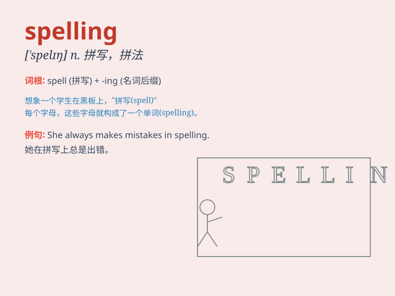

## spelling

**英音:** _[\'spelɪŋ]_ **美音:** _[\'spɛlɪŋ]_

**译义:** *n.拼法,拼写法*

### 短语

+ **spelling bee:** _拼字比赛_

+ **spelling mistake:** _拼写错误_

+ **improper spelling:** _不正确的拼写_

+ **correct spelling:** _正确的拼写_

+ **spelling reform:** _拼写改革_

### 例句

#### 例句1

> **I always make mistakes in my spelling.**

**中文翻译:** 我总是犯拼写错误。

**单词释义:** 拼写

#### 例句2

> **The spelling of this word is quite difficult.**

**中文翻译:** 这个词的拼写相当困难。

**单词释义:** 拼写

#### 例句3

> **You need to improve your spelling skills.**

**中文翻译:** 你需要提高你的拼写技巧。

**单词释义:** 拼写

### 背诵小故事

> One day, a little wizard was practicing his magic spells. But he kept
getting the spelling wrong and the spells didn\'t work. So he decided to
study hard to master the correct spelling of the spells.

**有一天，一个小巫师正在练习他的魔法咒语。但他一直拼错咒语，导致魔法不起作用。所以他决定努力学习，掌握咒语的正确拼写。**

### 图义

