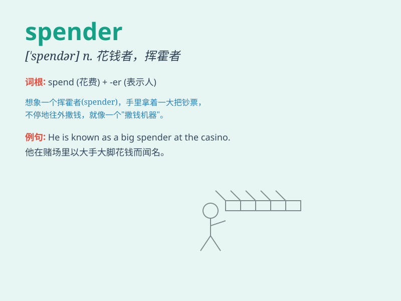

## spender

**英音:** _[\'spendə]_ **美音:** _[\'spɛndɚ]_

**译义:** *n.用钱的人,挥金如土的人*

### 短语

+ **big spender:** _大手大脚花钱的人；挥金如土者_

+ **lavish spender:** _挥霍无度的人_

+ **careless spender:** _粗心大意的消费者；花钱不谨慎的人_

+ **frugal spender:** _节俭的消费者；花钱节省的人_

+ **impulsive spender:** _冲动型消费者；冲动花钱的人_

### 例句

#### 例句1

> **She is a big spender when it comes to shopping.**

**中文翻译:** 她在购物方面是个大手笔。

**单词释义:** 花钱大手大脚的人

#### 例句2

> **The government is trying to control the spenders to balance the
budget.**

**中文翻译:** 政府正试图控制支出以平衡预算。

**单词释义:** 花钱者

#### 例句3

> **He is known as a cautious spender.**

**中文翻译:** 他以谨慎花钱而闻名。

**单词释义:** 花钱的人

### 背诵小故事

> A rich man was known as a big spender. He spent money freely on
luxurious cars and big houses. But one day, he realized he needed to
save. So, he changed and became more careful with his spending.
Remember, a spender is one who spends a lot.

**一个富人是出了名的大手大脚的花钱者。他随意地把钱花在豪车和大房子上。但有一天，他意识到他需要节省。所以，他改变了，在花钱方面变得更谨慎。记住，spender
就是花钱很多的人。**

### 图义

