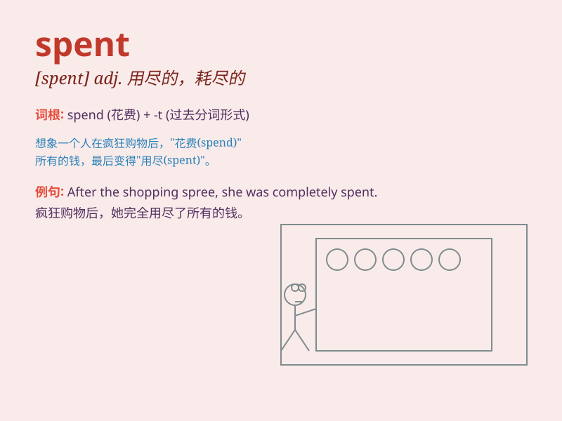

## spent

**英音:** _[spent]_ **美音:** _[spɛnt]_

**译义:** *adj.用尽的,精疲力尽的,失去效能的*

### 短语

+ **spent fuel:** _用过的燃料；乏燃料_

+ **spent time:** _花费的时间_

+ **spent money:** _花费的钱_

+ **spent force:** _消耗的力量_

+ **spent bullet:** _用过的子弹_

### 例句

#### 例句1

> **I spent two hours doing my homework yesterday.**

**中文翻译:** 昨天我花了两个小时做作业。

**单词释义:** 花费（时间）

#### 例句2

> **She spent a lot of money on clothes.**

**中文翻译:** 她在衣服上花了很多钱。

**单词释义:** 花费（金钱）

#### 例句3

> **He has spent all his energy on this project.**

**中文翻译:** 他把所有的精力都花在了这个项目上。

**单词释义:** 耗尽；用尽

### 背诵小故事

> A man was very tired after a long day at work. He said, \'I\'m
spent.\' It means he had used up all his energy. Just like when your
battery is spent and needs to be recharged.

**一个男人在工作了一整天后非常疲惫。他说：'我精疲力竭了。'这意味着他用光了所有的精力。就像你的电池没电了（spent）需要充电一样。**

### 图义

