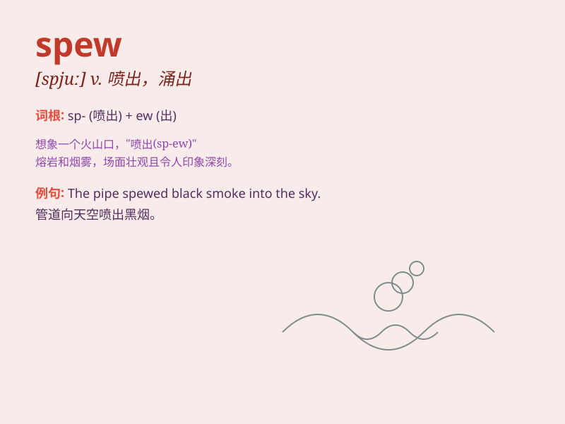

## spew

**英音:** _[spjuː]_ **美音:** _[spju]_

**译义:** *v.喷涌*

### 短语

+ **spew out:** _喷出；涌出_

+ **spew forth:** _大量喷出；滔滔不绝地讲_

+ **spew up:** _呕吐_

+ **spew smoke:** _喷出烟雾_

+ **spew lava:** _喷出熔岩_

### 例句

#### 例句1

> **The volcano continued to spew lava and ash.**

**中文翻译:** 火山继续喷出熔岩和火山灰。

**单词释义:** 喷出；涌出

#### 例句2

> **The factory chimney was spewing black smoke.**

**中文翻译:** 工厂的烟囱正冒着黑烟。

**单词释义:** 排放；喷出

#### 例句3

> **He began to spew forth a stream of abuse.**

**中文翻译:** 他开始滔滔不绝地谩骂。

**单词释义:** （大量地）吐，喷出（话语）

### 背诵小故事

>
想象一下，有一个巨大的火山正在喷发（spew），滚烫的岩浆从火山口不断涌出。就像这个火山一样，spew
这个单词表示喷出、涌出的意思。

**想象一个火山喷发的场景来辅助记忆 spew 这个表示喷出、涌出的单词。**

### 图义

